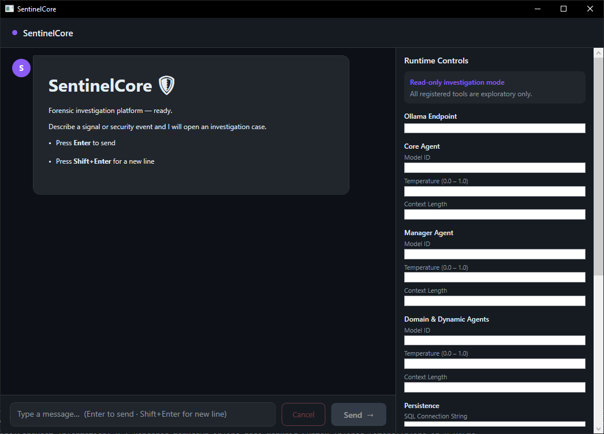
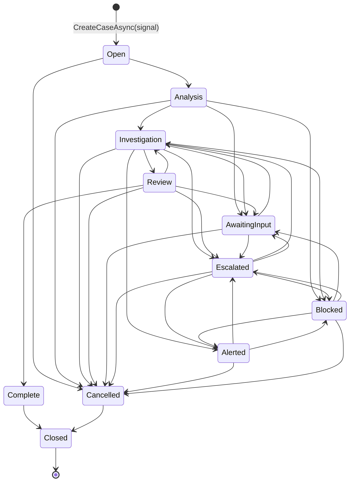

# SentinelCore

**Advanced Agentic Investigation Platform for Windows**



SentinelCore is a multi-agent AI investigation platform that learns from every case and interaction to accelerate future resolutions. It takes a signal — a prompt, an event log error, an anomaly alert — and orchestrates a team of AI agents to investigate, gather evidence, and deliver a diagnosis with remediation steps.

Built on the Microsoft Agent Framework with .NET 10, SentinelCore combines deterministic case lifecycle management, safety-gated state transitions, pattern memory, and 35+ agent personas to deliver accurate, auditable investigations on Windows systems.

---

## Key Features

- **Signal-driven investigations** — Submit a natural-language prompt, event log error, or anomaly alert and let the AI investigate
- **Multi-agent orchestration** — TheCore agent generates hypotheses; the Manager dispatches Domain Agents to gather evidence; an Analysis group validates findings
- **Deterministic case lifecycle** — 11-state state machine with safety gating ensures no case transitions without validation
- **Pattern memory** — Vectorized case history enables instant resolution when a similar signal has been seen before
- **Safety engine** — `ISafetyMiddleware` gates every state transition; hosts can inject custom rules to block, allow, or modify actions
- **35+ agent personas** — Slightly different perspectives produce richer debate and more accurate results
- **40+ Windows diagnostic tools** — Registry, WMI, Event Log, Defender, Hyper-V, Firewall, and more
- **Always-on persistence** — EF Core with SQL Server stores cases, evidence, signals, and pattern memory
- **Model flexibility** — Ollama (local), OpenAI, Azure OpenAI, GitHub Models, Anthropic, ONNX, or Foundry endpoints
- **Minimal host integration** — One extension method, one settings class, event handlers — you're running

---

## Architecture

```
┌──────────────────────────────────────────────────────────────────────┐
│                        SentinelCoreHost (WPF)                        │
│  Calls AddSentinelCore(), subscribes to ISentinelCoreEvents         │
└──────────────────────────────┬───────────────────────────────────────┘
                               │
┌──────────────────────────────▼───────────────────────────────────────┐
│              SentinelCore.Orchestrations (DI wiring)                  │
│  AgentBuilder · SentinelAgentFactory · TheCoreWorkflow                │
│  MagneticOrchestration · Executors · ToolRegistry · Events           │
├──────────────────────────────────────────────────────────────────────┤
│              SentinelCore.CaseFlowEngine (lifecycle)                  │
│  CaseFlowEngine · CaseRepository · EvidenceStore · PatternMemory    │
├──────────────────────────────────────────────────────────────────────┤
│              SentinelCore.Contracts (zero dependencies)               │
│  ICaseFlowEngine · ICaseRepository · IEvidenceStore · IPatternStore  │
│  ISafetyMiddleware · SafetyContext · SafetyVerdict · CaseStatus      │
│  Signal · Case · Evidence · SentinelCoreSettings · ModelProfile      │
│  ISentinelCoreEvents · ActivityType · OrchestrationType              │
└──────────────────────────────────────────────────────────────────────┘
```

### Dependency Rules (Immutable)

| Rule | Description |
|------|-------------|
| **Contracts is zero-dependency** | Only NuGet packages — no project references |
| **CaseFlowEngine depends on Contracts only** | Never references Orchestrations |
| **Orchestrations depends on Contracts + CaseFlowEngine** | Wires everything together via DI |
| **Host depends on all three** | Composes the final application |

---

## Case Lifecycle

The `CaseFlowEngine` is the **single owner** of case state. No agent, orchestrator, or host may mutate `CaseStatus` directly — all transitions flow through `ICaseFlowEngine.AdvanceCaseAsync()`.



Every transition is validated against the `AllowedTransitions` dictionary and gated by `ISafetyMiddleware.Evaluate()`. If the safety verdict is `Blocked`, the case is forced to `CaseStatus.Blocked` regardless of the requested target state.

---

## Investigation Flow

```
Signal
  ↓
TheCore (initial hypothesis + classification)
  ↓
  ├── IsNoise        → dismiss
  ├── CanAnswerDirectly → direct answer
  ├── PatternMatch   → instant resolution from memory
  ├── MoreInformationRequired → ask user
  ├── Investigate    → Magnetic Orchestration
  │     ↓
  │   Manager dispatches Domain Agents (workers)
  │     ↓
  │   Aggregator cleans evidence
  │     ↓
  │   Analysis Group (critic + reviewer)
  │     ↓
  │   Safety Gate
  │     ↓
  │   TheCore (final diagnosis + remediation)
  │     ↓
  │   Persist to DB
  ├── EscalateToHuman → human operator
  └── RedAlert        → critical alert
```

---

## Getting Started

### Prerequisites

- **.NET 10 SDK** (net10.0-windows target)
- **SQL Server** (local or remote) for persistence
- **Ollama** (or another model endpoint) for local AI inference

### 1. Configure Settings

Create a `SentinelCoreSettings` instance with your model and database configuration:

```csharp
var settings = new SentinelCoreSettings
{
    // SQL Server connection string (required — persistence is always-on)
    SqlConnectionString = "Server=.;Database=SentinelCore;Integrated Security=true;TrustServerCertificate=true",

    // Model configuration
    DefaultModel = new ModelProfile(
        endpoint: "http://127.0.0.1:11434",
        modelId: "llama3.2",
        temperature: 0.2f,
        maxOutputTokens: 16000,
        topK: 1,
        topP: 0.1f,
        provider: ModelProvider.Ollama),

    DefaultUtilityModel = new ModelProfile(
        endpoint: "http://127.0.0.1:11434",
        modelId: "llama3.2",
        temperature: 0.1f,
        maxOutputTokens: 12000,
        topK: 1,
        topP: 0.3f,
        provider: ModelProvider.Ollama),

    // Orchestration type
    OrchestrationType = OrchestrationType.TheCore,

    // Optional: enable trace logging
    TraceEnabled = true,
    TraceLogLevel = LogLevel.Trace
};
```

### 2. Register Services

Call the single entry point in your host's `IServiceCollection` configuration:

```csharp
services.AddSentinelCore(settings);
```

This registers **all** SentinelCore services unconditionally:

| Service | Lifetime | Description |
|---------|----------|-------------|
| `ICaseFlowEngine` | Transient | Case lifecycle state machine |
| `ICaseRepository` | Transient | Case persistence (internal to CFE) |
| `IEvidenceStore` | Transient | Evidence storage |
| `IPatternMemoryStore` | Transient | Pattern memory (vector search) |
| `ISafetyMiddleware` | Singleton | Safety gate (defaults to `NullSafetyMiddleware`) |
| `ISentinelCoreEvents` | Singleton | Event hub for UI integration |
| `IAgentProfileBuilder` | Singleton | Agent specification factory |
| `ISystemReporter` | Singleton | Error/info reporting |
| `ISentinelWorkflowExecution` | Singleton | Workflow execution engine |
| `TheCoreWorkflow` | Singleton | Main investigation workflow |
| `ISentinelAgentFactory` | Singleton | Agent construction pipeline |
| `IOrchestrationFactory` | Singleton | Orchestration type factory |
| `MagneticOrchestration` | Singleton | Multi-agent orchestration |
| `SentinelCoreDBContext` | Scoped | EF Core DbContext |

### 3. Subscribe to Events

```csharp
var events = serviceProvider.GetRequiredService<ISentinelCoreEvents>();

events.SentinelOutputEvent += (args) =>
{
    // args.AgentName, args.Message, args.ActivityType
    Console.WriteLine($"[{args.ActivityType}] {args.AgentName}: {args.Message}");
};

events.ErrorOccurred += (message, exception) =>
{
    Console.Error.WriteLine($"ERROR: {message}", exception);
};
```

### 4. Start an Investigation

```csharp
var orchestrationControl = serviceProvider.GetRequiredService<IOrchestrationControl>();

await orchestrationControl.InitializeOrchestrationAsync(
    new ChatMessage(ChatRole.User, "Investigate Event log error 123456"),
    cancellationToken);
```

---

## Optional: Custom Safety Middleware

The default `NullSafetyMiddleware` allows all transitions. To enforce custom rules:

```csharp
public class MySafetyMiddleware : ISafetyMiddleware
{
    public SafetyVerdict Evaluate(SafetyContext context)
    {
        // Block high-risk operations outside business hours
        if (context.CaseId is not null && IsOutsideBusinessHours())
            return SafetyVerdict.Blocked;

        return SafetyVerdict.Allowed;
    }
}

// Register before AddSentinelCore or replace after:
services.AddSingleton<ISafetyMiddleware, MySafetyMiddleware>();
```

---

## Optional: Investigation Control

To enable advanced case management with pattern memory and investigation control:

```csharp
services.AddSentinelCore(settings)
        .AddInvestigationControl();
```

---

## Project Structure

```
projects/
├── SentinelCore.Contracts/          # Zero-dependency shared abstractions
│   ├── Abstractions/                # ICaseRepository, IEvidenceStore, IPatternMemoryStore,
│   │                                # ISystemReporter, ISignalRepository, Throw
│   ├── CaseFlow/                    # ICaseFlowEngine, Case, CaseStatus, Signal, Evidence
│   ├── Contracts/                   # SentinelCoreSettings, ModelProfile, OrchestrationType
│   ├── DependencyInjection/         # ISentinelCoreBuilder
│   ├── Events/                      # ISentinelCoreEvents, ActivityType, SentinelOutputEventArgs
│   └── SafetyEngine/                # ISafetyMiddleware, SafetyContext, SafetyVerdict,
│                                    # NullSafetyMiddleware
│
├── SentinelCore.CaseFlowEngine/     # Case lifecycle, persistence, pattern memory
│   ├── CaseFlow/                    # CaseFlowEngine (state machine)
│   ├── Infrastructure/
│   │   ├── DependencyInjection/     # AddInvestigationControl builder extension
│   │   └── Persistence/             # CaseRepository, EvidenceStore, PatternMemoryStore,
│   │                                # SignalRepository, DatabaseInitializer
│   ├── Migrations/                  # EF Core SQL Server migrations
│   └── Persistence/                 # SentinelCoreDBContext, entity types
│
├── SentinelCore.Orchestrations/     # Agent construction, orchestration, tools, DI
│   ├── Abstractions/                # IOrchestration, IOrchestrationControl
│   ├── Agents/                      # AgentBuilder, AgentProfile, AgentRole,
│   │                                # SentinelAgentFactory, SentinelChatClientFactory,
│   │                                # AgentMiddlewarePipeline, TheCoreRunner
│   │   └── Middleware/              # EventPublishingChatClient, PatternMemoryInjector
│   ├── Application/                 # OrchestrationControl, OrchestrationFactory,
│   │                                # SentinelWorkflowExecution, ToolRegistry
│   ├── Exceptions/                  # SentinelCaseEngineException, SentinelCoreModelException,
│   │                                # SentinelCorePlatformException, SentinelOrchestrationException
│   ├── Factories/                   # (reserved)
│   ├── Infrastructure/DependencyInjection/
│   │                                # SentinelCoreServiceExtensions (AddSentinelCore),
│   │                                # SentinelCoreBuilder, ExecutorRegistration
│   ├── Orchestrations/              # MagneticOrchestration, ApprovalBasedManager
│   ├── Personas/                    # PersonaRegistry (35+ personas)
│   ├── Tools/                       # 40+ Windows diagnostic AITools
│   │   └── Interop/                 # WMI, PowerShell, Registry interop helpers
│   └── Workflows/                   # TheCoreWorkflow, CoreRoutingDecision,
│       │                            # SignalHypothesis, WorkflowBase, WorkflowMessage
│       └── Executors/               # NewCase, Investigation, Analysis, Safety,
│                                        PatternCheck, Aggregation, Clarification,
│                                        Escalated, CriticalAlert, DirectAnswer,
│                                        IsNoise, WhiteList, VerifyEvidence,
│                                        HumanOperator, CaseUpdate, Logging, Persist,
│                                        SubWorkflow, TheCoreExec, AgentExecutor
│
├── SentinelCore.Tests/              # Unit and integration tests
│
└── SentinelCoreHost/               # WPF host application
    ├── App.xaml.cs                  # Host composition root
    ├── ViewModels/                  # MVVM view models
    ├── Views/                       # WPF views
    └── Converters/                  # JSON logger, UI converters
```

---

## Key Abstractions

### Contracts (`SentinelCore.Contracts`)

| Type | Description |
|------|-------------|
| `ICaseFlowEngine` | Owns the case lifecycle. Create cases and advance status. |
| `ICaseRepository` | Internal persistence for case records. Use `ICaseFlowEngine` instead. |
| `IEvidenceStore` | Append and retrieve evidence items for a case. |
| `IPatternMemoryStore` | Store and search vectorized case patterns. |
| `ISafetyMiddleware` | Evaluate `SafetyContext` → `SafetyVerdict` (Allowed/Blocked/Modified). |
| `ISentinelCoreEvents` | Event hub for UI integration (output, errors, orchestration). |
| `ISystemReporter` | Report errors, warnings, and info to logging + event stream. |
| `IOrchestrationControl` | Entry point to start an orchestration from a signal. |
| `ISentinelWorkflowExecution` | Execute a `Workflow` with event capture. |
| `IAgentProfileBuilder` | Build `AgentProfile` specs by role and name. |
| `ISentinelAgentFactory` | Construct `AIAgent` instances from profiles. |
| `IOrchestrationFactory` | Create `IOrchestration` instances by `OrchestrationType`. |

### Case Flow (`SentinelCore.CaseFlowEngine`)

| Type | Description |
|------|-------------|
| `CaseFlowEngine` | Default `ICaseFlowEngine` implementation. Validates transitions, gates with safety. |
| `CaseRepository` | EF Core implementation of `ICaseRepository`. |
| `EvidenceStore` | EF Core implementation of `IEvidenceStore`. |
| `PatternMemoryStore` | EF Core implementation of `IPatternMemoryStore`. |
| `SignalRepository` | EF Core implementation of `ISignalRepository`. |
| `DatabaseInitializer` | `IHostedService` that runs EF Core migrations on startup. |
| `SentinelCoreDBContext` | EF Core DbContext for SQL Server persistence. |

### Safety Engine (`SentinelCore.SafetyEngine`)  -- stubs/hooks only, design TBD

| Type | Description |
|------|-------------|
| `ISafetyMiddleware` | Evaluate a `SafetyContext` and return a `SafetyVerdict`. |
| `SafetyContext` | Carries `CaseId`, `FunctionCall`, `FunctionResult`, `Message`, `MutatingToolNames`, `RegisteredToolNames`. |
| `SafetyVerdict` | `Allowed`, `Blocked`, or `Modified`. |
| `NullSafetyMiddleware` | Default pass-through — always returns `Allowed`. |

### Orchestration (`SentinelCore.Orchestrations`) -- (Single pattern version)

The platform is built around selectable varying patterns for many use cases.
** Extra patterns have been removed from the Forensics Edition

| Type | Description |
|------|-------------|
| `TheCoreWorkflow` | Main investigation workflow with signal classification and routing. |
| `MagneticOrchestration` | Multi-agent orchestration: Manager dispatches Domain Agents. |  -- reduced to mag workflow
| `OrchestrationControl` | `IOrchestrationControl` implementation — starts an orchestration. |
| `OrchestrationFactory` | Creates `IOrchestration` instances by `OrchestrationType`. |  -- Expansion to add orchestrations
| `SentinelAgentFactory` | Builds `AIAgent` from `AgentProfile` with full middleware pipeline. |
| `AgentBuilder` | Constructs agents with logging, events, safety, and pattern memory. |
| `AgentProfile` | Immutable specification for agent construction (model, tools, persona, role). |
| `AgentRole` | `Core`, `Manager`, or `Utility`. |  -- Phasing out in favor of profile
| `AgentMiddlewarePipeline` | Predefined middleware stacks: Core, Default, Domain, Manager, Minimal. |  -- RAG/KB indexing/specialty knowledge
| `ToolRegistry` | Maps 40+ Windows diagnostic tools to domain categories. | --- Read-only system interrogaters

---

## Model Providers

SentinelCore supports multiple model providers via `ModelProfile`:

| Provider | Endpoint Example | Notes |
|----------|-----------------|-------|
| `Ollama` | `http://127.0.0.1:11434` | Local/cloud inference, air-gapped capable |
| `OpenAI` | `https://api.openai.com/v1` | Requires `ApiKey` |
| `AzureOpenAI` | `https://<resource>.openai.azure.com` | Requires `ApiKey` |
| `GitHubModels` | `https://models.inference.ai.azure.com` | Requires `ApiKey` |
| `Anthropic` | — | Planned (not yet implemented) |
| `Foundry` | — | Azure AI Foundry |
| `ONNX` | Local file path | On-device inference via `ModelPath` + `ExecutionProvider` |

---

## Agent Personas

35+ built-in personas give agents distinct perspectives for richer debate and more accurate results:
These have been crafted to only alter a point of view, not restrict any system or user instruction.
This eliminates stale group debates, encourages variations in thinking patterns, paired with TopN and temperature you get a clean
separation of ideas and an actual group discussion that can produced inventive and powerful variations with the same model accross the board.

| Category | Personas |
|----------|----------|
| Leadership | TheArchitect, TheLeader, TheManager, TheStrategist, TheVisionary |
| Analysis | TheAnalyst, TheResearcher, TheEvaluator, TheCritic |
| Building | TheEngineer, TheDesigner, TheInnovator, TheImplementer |
| Communication | TheCommunicator, TheCollaborator, TheNegotiator, TheInfluencer, TheAdvisor |
| Support | TheMentor, TheCoach, TheFacilitator, TheSupporter, TheTrainer, TheEducator, TheMotivator, TheInspirer |
| Operations | ThePlanner, TheOrganizer, TheTester, TheMaintainer, TheProblemSolver, TheDecisionMaker |

---

## Windows Diagnostic Tools -- Forensics edition focus --

Send it logs overnight and come in the next day with a list of remediation steps
to fix what it found. Tools are exploratory only, operator applies fixes.

40+ read-only AITools organized by domain:

| Domain | Tools |
|--------|-------|
| System | Registry, WMI, Environment Variables, Processes, Services, Drivers, Boot Config |
| Security | Defender, Firewall, AppLocker, BitLocker, UAC, Credentials, Certificates, Auditing |
| Network | Network, VPN, Wireless, Proxy, RDP |
| Hardware | Battery, Display, PnP Devices, Sensors, Hyper-V |
| Software | Installed Apps, Browser Config, Fonts, Search Indexing, Scheduled Tasks |
| User | Local Accounts, Group Policy, Notifications, Accessibility, Shell Explorer |

---

## Events System

Sentinel Core features a packaged design, A DI container for serving up services
All output (agent response) is sent to ILoggerFactory and to public Events that can be directed as needed.
A detailed transactional history is written to disk for accountability/audit puposes.
Reasoning/thinking and group debate conversations can also be enabled to show the complete pipeline.
`ISentinelCoreEvents` is the single event hub for host UI integration:

```csharp
public interface ISentinelCoreEvents
{
    event Action<string, Exception>? ErrorOccurred;
    event Action<OrchestrationActivityArgs>? OrchestrationEvent;
    event Action<SentinelOutputEventArgs>? SentinelOutputEvent;

    void RaiseError(string message, Exception exception);
    void RaiseOrchestrationEvent(OrchestrationActivityArgs payload);
    void RaiseSentinelOutputEvent(SentinelOutputEventArgs args);
}
```

`ActivityType` discriminators: `Core`, `Reasoning`, `Tooling`, `Manager`, `Participant`, `WorkflowTooling`, `Orchestration`, `System`.

---

## Exceptions

| Exception | Purpose |
|-----------|---------|
| `SentinelCaseEngineException` | Errors in case lifecycle operations |
| `SentinelCoreModelException` | Errors directly attributable to the AI model |
| `SentinelCorePlatformException` | Fatal platform errors requiring immediate attention |
| `SentinelOrchestrationException` | Errors during orchestration execution |

---

## Database -- Forecsics edition requires database

This edition combines several context enriching strategies to give the models domain specific information for whatever environment you choose to use the platform for.

Remote KB Indexing - Fast search and only "retrieves" when needed. Local db only contains minimal metadata and the searchable vectors, could be a summary or snippet from entire doc/page
You only store locally your vectors and where the page/doc lives in the wild if you need it. No need to ingest entire websites or document stores
Pattern match middleware - vector indexes are created from resovled cases and are searched first to speed up repeat cases. This builds up over time and is specific to your environment.
A preset knowledge base of case histories can be installed to get the ball rolling. Or you can just give it directions like "examine the system to identify problems." Sentinel Core dispatches the workers to examine the system.


SentinelCore uses **EF Core with SQL Server** for persistence. The database is initialized automatically via `DatabaseInitializer` (an `IHostedService` that runs migrations on startup).

**Tables:** `CaseEntities`, `SignalEntities`, `EvidenceEntities`, `InvestigationPlanEntities`, `InvestigationPlanStepsEntities`, `PatternMemoryEntities`, `ResolutionEntities`

---

## Running Tests

```bash
dotnet test projects/SentinelCore.Tests/SentinelCore.Tests.csproj
```

---

## License

AI Agent patterns and orchestrations are proprietary and require special permission to use in whole or in part.
Agent Framework (MAF) is owned by Microsoft and I claim no rights to their products outside of normal end-user licensing.

See [LICENSE](LICENSE) for details.

A very special shout out goes to the MAF team. This framework sprang up so quickly I created a special RAG system to keep my agents up to date with the days new code, every commit. New types daily no way for agents to keep up had to be forced fed the new info to be of any use at all. This framework is so powerful when you peel back the layers and extremely flexible. If you ever want to do anything with AI, Start Here!!! MAF is the future.
