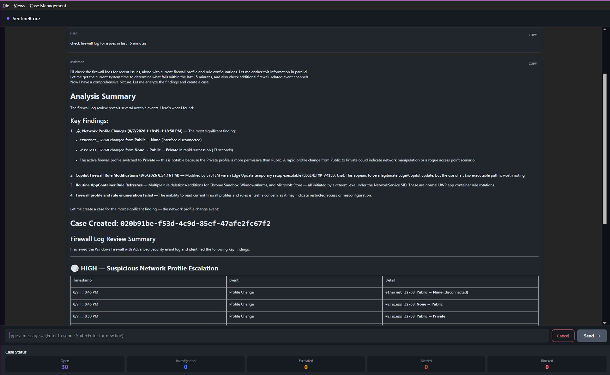
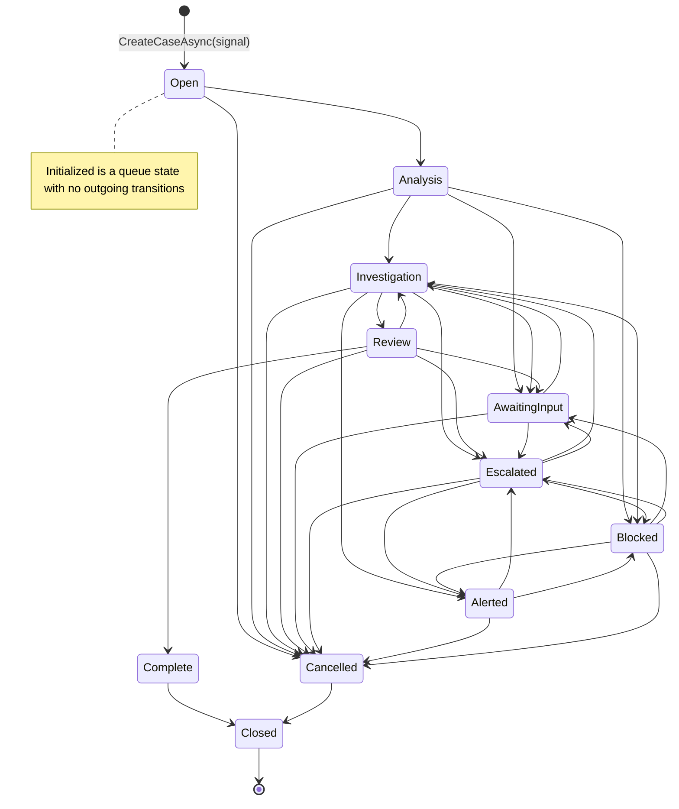

# Sentinel Core

**Advanced Agentic Investigation Platform for Windows**



Sentinel Core is a multi-agent AI investigation platform that learns from every case and interaction to accelerate future resolutions. It takes a signal — a prompt, an event log error, an anomaly alert — and orchestrates a team of AI agents to investigate, gather evidence, and deliver a diagnosis with remediation steps.

Built on the Microsoft Agent Framework (MAF) with .NET 10, Sentinel Core combines deterministic case lifecycle management, a rule-based safety engine, pattern memory, and 33 registered agent personas to deliver accurate, auditable investigations on Windows systems. Explore the power of MAF and versatility with this application using multi-agents, RAG, context enriching, workflows, executors, multi-provider flexibility. NOTE: MAF is still under development.

## **RELEASE DATE:** I am expecting to release v1.0 by the end of the month. I expect to have all the features implemented, they may not be fully polished yet, but I should have both editions done, regular and deluxe done by October 1st

---

## New Features

    Some unexpected enhancements were implemented that change the application in a huge way.
    Sentinel Core now has MCP support. Knowledge and tools can be added live giving this forensic platform a completely different purpose. Sentinel Core ships with the Windows troubleshooting toolkit (MCP Server) other toolkits may be purchased for various  other domains and purposes such as enterprise toolkit which has tools for SQL Server,

    Deluxe Edition:
    This will include selectable preset orchestration patterns, that opens the platform to a whole new level of investigation or collaboration.
    There is magnetic group, cooperative group, adversarial group, group hand-off to name a few. Paired up with the personas each agent in the group can have a slightly different perspective, giving a brainstorming session a powerful twist.

    Plans are underway to introduce do-it-yourself orchestration patterns. This will allow you to create your own orchestration pattern and have it run in the system. This is a huge feature that will allow you to assemble agents in a workflow of your own design. This will be a paid feature and will be available in the deluxe edition only.

---

## Feature Development Status

|           Feature            |                                                                               Description                                                                                | Status |
| :-------------------------- | :---------------------------------------------------------------------------------------------------------------------------------------------------------------------- | :----: |
|      RAG Knowledge Base      |                                                     Keyword/fuzzy search over an in-memory index with an on-demand retrieval tool and context injector; vector search is stubbed pending an embedding provider.                                                       |  60%   |
|  Multi-agent Orchestration   |                                          `TheCoreWorkflow` routes signals through executors and delegates evidence gathering to a Magentic sub-workflow (Manager + 3 Workers).                                           |   ✅   |
|        Pattern Memory        |                               `IPatternMemoryStore` persists vectorized case patterns; `SemanticPatternMatcher` currently matches by keyword (vector search stubbed).                                |  50%   |
| Signal-driven Investigations |                                 Submit a natural-language prompt, event log error, or automated anomaly alert the let the AI investigate                                 |   ✅   |
| Deterministic Case Lifecycle |                                         `CaseStatus` defines 12 statuses; 11 participate in the `AllowedTransitions` table enforced by `CaseFlowEngine`.                                         |   ✅   |
|        Safety Engine         |                            Rule-based `ISafetyRule` pipeline (18 rules) applied to agents via `UseSafetyEngine()`; the case-transition gate in `AdvanceCaseAsync` is currently disabled.                            |  60%   |
|       Agent Personas         |                                             33 personas registered in `PersonaRegistry`; 36 persona definitions available.                                             |   ✅   |
|            Tools             |                                                    Windows diagnostic tools moved out of the library into a separate MCP server; the library retains `CaseTool` and the MCP client tools.                                                     |  100%  |
|         MCP Support          | Pluggable design allows system to shift focus to any domain, medical, fabrication, manufacturing etc. by switching knowledge sources and toolsets that act as the hands. |   ✅   |
|        LLM providers         |                  Ollama, OpenAI, Azure OpenAI, and GitHub Models are implemented. Anthropic, ONNX, Foundry, and Azure are declared but not yet implemented.                  |   ✅   |

---

## Feature Details

- **Multi-agent orchestration** — TheCore agent is at the heart and handles main reasoning and long term context memory. Several supportive agents are used for short term workload and pure decision gating. Nested workflows and executors keeps logic modular and easy to debug. Isolated core keeps main context clean and reduces model latency and increases over all reasoning accuracy. Design breaks up workload to allow for smaller local models to perform targeted tasks and not prone to stall.
- **Air-gapped capable** — Ollama local model endpoint allows for fully air-gapped operation. No internet connection is required to run the system. All models and tools can be run locally.
- **Versatile Design** - Pluggable RAG knowledge base allows system to shift focus to any domain, medical, fabrication, manufacturing etc. RAG features keyword search over an in-memory index with an on-demand retrieval tool; vector indexing is stubbed pending an embedding provider.
- **RAG Knowledge Base** — On-demand retrieval through `RagSearchTool` plus optional context injection. The local database stores only minimal metadata and searchable vectors — a summary or snippet from an entire doc/page — along with where the page/doc lives in the wild. No need to ingest entire websites or document stores. MCP servers can also act as a knowledge source.
- **Pattern memory** — `IPatternMemoryStore` persists vectorized case history and resolutions so a similar signal can be recognized quickly. `SemanticPatternMatcher` currently matches by keyword; vector similarity search is stubbed.
- **Signal-driven investigations** — Submit a natural-language prompt, event log error, or automated anomaly alert the let the AI investigate
- **Deterministic case lifecycle** — `CaseStatus` defines 12 statuses; 11 participate in the `AllowedTransitions` table enforced by `CaseFlowEngine`
- **Safety engine** — Rule-based `ISafetyRule` pipeline (18 rules) applied to agents through `UseSafetyEngine()`; hosts can supply their own rules
- **33 agent personas** — Slightly different perspectives produce richer debate and more accurate results
- **Windows diagnostic tools** — Registry, WMI, Event Log, Defender, Hyper-V, Firewall, and more, now delivered through a separate MCP server
- **Always-on persistence** — EF Core with SQL Server stores cases, evidence, signals, and pattern memory
- **Model flexibility** — Ollama (local), OpenAI, Azure OpenAI, and GitHub Models are implemented; Anthropic, ONNX, Foundry, and Azure are declared
- **Minimal host integration** — One extension method, one settings class, event handlers — you're running

- **NEW** Tools moved to MCP Local server project for easier management and system flexibility - server can be deployed to other targets

---

## Architecture

┌──────────────────────────────────────────────────────────────────────┐
│ SentinelCore.UI (WPF) │
│ Calls AddSentinelCore(), subscribes to ISentinelCoreEvents │
└──────────────────────────────┬───────────────────────────────────────┘
│
┌──────────────────────────────▼───────────────────────────────────────┐
│ SentinelCore.Orchestrations (DI wiring) │
│ AgentProfileBuilder · SentinelAgentFactory · TheCoreWorkflow │
│ Magentic sub-workflow · Executors · SafetyEngine · MCP · Events │
├──────────────────────────────────────────────────────────────────────┤
│ SentinelCore.CaseFlowEngine (lifecycle) │
│ CaseFlowEngine · EvidenceStore · PatternMemoryStore · SignalRepository │
├──────────────────────────────────────────────────────────────────────┤
│ SentinelCore.Contracts (zero dependencies) │
│ ICaseFlowEngine · IEvidenceStore · IPatternMemoryStore │
│ ISignalRepository · ISystemReporter · CaseStatus · Case · Signal │
│ SentinelCoreSettings · ModelProfile · ISentinelCoreEvents │
│ ActivityType · OrchestrationType · MCP contracts │
└──────────────────────────────────────────────────────────────────────┘

### Dependency Rules (Immutable)

| Rule                                                     | Description                                 |
| -------------------------------------------------------- | ------------------------------------------- |
| **Contracts is zero-dependency**                         | Only NuGet packages — no project references |
| **CaseFlowEngine depends on Contracts only**             | Never references Orchestrations             |
| **Orchestrations depends on Contracts + CaseFlowEngine** | Wires everything together via DI            |
| **UI depends on all three**                              | Composition root for the WPF application    |

---

## Case Lifecycle

The `CaseFlowEngine` is the **single owner** of case state. No agent, orchestrator, or host may mutate `CaseStatus` directly — all transitions flow through `ICaseFlowEngine.AdvanceCaseAsync()`.



Every transition is validated against the `AllowedTransitions` dictionary in `CaseFlowEngine`. `CaseStatus.Initialized` is a queue state for cases that have been created but not yet handed to the workflow; it has no outgoing transitions in the table. The safety gate inside `AdvanceCaseAsync` is currently commented out — the `ISafetyMiddleware`/`SafetyVerdict` types it referenced no longer exist. Safety is enforced today by the rule-based `ISafetyRule` pipeline applied to agents.

---

## Investigation Flow

```
Signal
  ↓
PatternCheckExecutor (pattern memory lookup)
  ↓
SafetyExecutor (ISafetyRule pipeline)
  ↓
ClassifierAgentExec (SignalHypothesis + NextStep)
  ↓
  ├── Investigate            → NewCaseExecutor
  ├── RedAlert               → CriticalAlert
  ├── MoreInformationRequired→ MoreInformationExecutor
  ├── EscalateToHumanOperator→ HumanOperatorExecutor
  ├── DirectAnswer           → DirectAnswerExecutor
  └── (default)              → NewCaseExecutor
        ↓
      TheCoreExec (persistent Core session)
        ↓
      EvidenceCollection sub-workflow (Magentic: Manager + Worker1/2/3)
        ↓
      AggregationExecutor
        ↓
      TheCoreExec (loop — final diagnosis + remediation)
```

The routing graph is composed in `TheCoreWorkflow.BuildWorkflow()` using `WorkflowBuilder` with a switch on `SignalHypothesis.NextStep`. The evidence-gathering sub-workflow is built with `MagenticWorkflowBuilder` (max 3 resets, 3 rounds, 2 stalls, plan sign-off not required) and bound as the `EvidenceCollection` executor.

---

## Getting Started

### Prerequisites

- **.NET 10 SDK** (net10.0-windows target)
- **SQL Server** (local or remote) for persistence
- **Ollama** (or another model endpoint) for local AI inference
- **Environment variables** — `SENTINEL_CORE` (case-flow database connection string) and `REMOTEKB` (remote knowledge-base connection string). The WPF host fails fast at startup when either is missing.

### 1. Configure Settings

Create a `SentinelCoreSettings` instance with your model and database configuration. Model profiles are keyed per logical agent name in `AgentModels`; an agent with no entry falls back to its role tier, and an agent with no configuration anywhere fails the factory gate with a descriptive error.

```csharp
var settings = new SentinelCoreSettings
{
    // SQL Server connection string (required — persistence is always-on)
    SqlConnectionString = "Server=.;Database=SentinelCore;Integrated Security=true;TrustServerCertificate=true",

    // Per-agent model profiles keyed by logical agent name
    // ("TheCore", "Classifier", "SafetyAgent", "Manager", "Worker1".."Worker3")
    AgentModels = new Dictionary<string, ModelProfile>(StringComparer.OrdinalIgnoreCase)
    {
        ["TheCore"] = new ModelProfile(
            endpoint: "http://127.0.0.1:11434",
            modelId: "llama3.2",
            temperature: 0.2f,
            maxOutputTokens: 16000,
            topK: 1,
            topP: 0.1f,
            provider: ModelProfile.ModelProvider.Ollama)
    },

    // Fallback model used when no specialized model is configured
    DefaultModel = new ModelProfile(
        endpoint: "http://127.0.0.1:11434",
        modelId: "llama3.2",
        temperature: 0.2f,
        maxOutputTokens: 16000,
        topK: 1,
        topP: 0.1f,
        provider: ModelProfile.ModelProvider.Ollama),

    // Utility model for worker/utility agents
    DefaultUtilityModel = new ModelProfile(
        endpoint: "http://127.0.0.1:11434",
        modelId: "llama3.2",
        temperature: 0.1f,
        maxOutputTokens: 12000,
        topK: 1,
        topP: 0.3f,
        provider: ModelProfile.ModelProvider.Ollama),

    // Model for the Magentic Manager agent (falls back to DefaultModel)
    ManagerModel = null,

    // Orchestration type
    OrchestrationType = OrchestrationType.TheCore,

    // Optional: RAG search configuration (null disables RAG)
    RagSearch = RagSearchOptions.Default,

    // Optional: safety engine configuration
    SafetyEngine = new SafetyEngineSettings { IsEnabled = true },

    // Optional: enable trace logging
    TraceEnabled = true,
    TraceLogLevel = LogLevel.Trace
};
```

### 2. Register Services

Call the single entry point in your host's `IServiceCollection` configuration:

```csharp
services.AddSentinelCore(settings);
```

This registers **all** SentinelCore services unconditionally:

| Service                      | Lifetime  | Description                                      |
| ---------------------------- | --------- | ------------------------------------------------ |
| `ICaseFlowEngine`            | Transient | Case lifecycle state machine                     |
| `IEvidenceStore`             | Transient | Evidence storage                                 |
| `IPatternMemoryStore`        | Transient | Pattern memory (vector search)                   |
| `IPatternMatcher`            | Transient | Semantic pattern matcher (keyword-based today)   |
| `IRagSearchService`          | Singleton | RAG search service                               |
| `ISentinelCoreEvents`        | Singleton | Event hub for UI integration                     |
| `IAgentProfileBuilder`       | Singleton | Agent profile factory                            |
| `IAgentPresetProvider`       | Singleton | Agent preset registry                            |
| `ISystemReporter`            | Singleton | Error/info reporting                             |
| `ISentinelWorkflowExecution` | Singleton | Workflow execution engine                        |
| `TheCoreWorkflow`            | Singleton | Main investigation workflow                      |
| `ISentinelAgentFactory`      | Singleton | Agent construction pipeline                      |
| `IOrchestrationFactory`      | Singleton | Orchestration type factory                       |
| `IOrchestrationControl`      | Singleton | Entry point to start an orchestration            |
| `MagneticOrchestration`      | Singleton | Magnetic orchestration helper                    |
| `IMcpServerRegistry`         | Singleton | MCP server registry                              |
| `IMcpServerRegistryStore`    | Singleton | MCP registry persistence (JSON file)             |
| `IMcpConnectionFactory`      | Singleton | MCP client connection factory                    |
| `ISentinelAgentCatalog`      | Singleton | Logical agent name catalog                       |
| `McpServerRegistryInitializer` | Hosted  | Loads persisted MCP servers at startup           |
| Executors                    | Transient | All workflow executors                           |

> **Note:** `AddSentinelCore` does **not** register a `DbContext` factory. The composition root must call `services.AddDbContextFactory<SentinelCoreDBContext>(...)` (and `AddDbContextFactory<SentinelRAGDBContext>(...)` for the remote KB) — see pattern-lock PL-7. Without it, persistence consumers fail activation with an `IDbContextFactory` error.

### 3. Subscribe to Events

```csharp
var events = serviceProvider.GetRequiredService<ISentinelCoreEvents>();

events.SentinelOutputEvent += (args) =>
{
    // args.AgentName, args.Message, args.ActivityType
    Console.WriteLine($"[{args.ActivityType}] {args.AgentName}: {args.Message}");
};

events.ErrorOccurred += (message, exception) =>
{
    Console.Error.WriteLine($"ERROR: {message}", exception);
};
```

### 4. Start an Investigation

```csharp
var orchestrationControl = serviceProvider.GetRequiredService<IOrchestrationControl>();

await orchestrationControl.InitializeOrchestrationAsync(
    new ChatMessage(ChatRole.User, "Investigate Event log error 123456"),
    cancellationToken);
```

---

## Optional: Custom Safety Rules

Safety is enforced by a composable rule pipeline. Implement `ISafetyRule` and apply it to an agent with the `UseSafetyEngine()` builder extension:

```csharp
public sealed class BusinessHoursRule : ISafetyRule
{
    public string Name => "BusinessHours";
    public string Description => "Blocks high-risk operations outside business hours.";

    public Task<SafetyRuleResult> EvaluateAsync(SafetyEvaluationContext context, CancellationToken cancellationToken = default)
    {
        return Task.FromResult(IsOutsideBusinessHours()
            ? SafetyRuleResult.Block(Name, SafetySeverity.High, "Outside approved operating hours.")
            : SafetyRuleResult.Allow(Name));
    }
}

// Apply to an agent pipeline:
AIAgent safeAgent = agent.AsBuilder()
    .UseSafetyEngine(new[] { new BusinessHoursRule() }, loggerFactory.CreateLogger<SafetyEngineAgent>())
    .Build();
```

`SafetyEngineSettings` on `SentinelCoreSettings` controls the engine: `IsEnabled`, `StopOnFirstBlock`, `TreatRuleErrorsAsBlocks`, `EnableRateLimiting`, `MaxRequestsPerMinute`, `EnableOutputSanitization`, `CustomBlocklistTerms`, `CustomBlocklistPatterns`, and `BlockedResponseMessage`.

> **Note:** `SentinelAgentFactory.CreateSafetyRules()` currently returns an empty rule list, so the safety engine is wired but inert until rules are supplied.

---

## Optional: MCP Servers

MCP servers are registered at runtime and their tools are injected into agents by `SentinelAgentFactory`. Definitions persist to `%APPDATA%\SentinelCore\mcp-servers.json` (override with `SENTINEL_MCP_REGISTRY_PATH`); OAuth tokens are cached DPAPI-encrypted in `mcp-tokens.bin`.

```csharp
var registry = serviceProvider.GetRequiredService<IMcpServerRegistry>();

await registry.RegisterAsync(new McpServerDefinition(
    id: "windows-toolkit",
    displayName: "Windows Troubleshooting Toolkit",
    transportType: McpServerTransportType.Stdio,
    commandOrEndpoint: "SentinelCore.Mcp.Windows",
    assignedAgentNames: []));   // empty = available to every agent

await registry.StartAsync("windows-toolkit", cancellationToken);
```

A server with an empty `AssignedAgentNames` list is available to all agents; otherwise only the listed logical agent names receive its tools. The WPF host exposes this through the **MCP Servers** page.

---

## Project Structure

```
projects/
├── SentinelCore.Contracts/          # Zero-dependency shared abstractions
│   ├── Abstractions/                # IEvidenceStore, IPatternMemoryStore, ISignalRepository,
│   │                                # ISystemReporter, PatternMemoryResult, Throw
│   ├── CaseFlow/                    # Case, Signal, Evidence, InvestigationPlan,
│   │                                # InvestigationPlanStep, Resolution
│   ├── Cfe/                         # CaseStatus
│   ├── Contracts/                   # SentinelCoreSettings, ModelProfile, OrchestrationType
│   ├── DependencyInjection/         # ISentinelCoreBuilder
│   ├── Events/                      # ISentinelCoreEvents, SentinelCoreEvents, ActivityType,
│   │                                # SentinelOutputEventArgs, OrchestrationActivityArgs
│   └── Mcp/                         # IMcpServerRegistry, IMcpServerRegistryStore,
│                                    # ISentinelAgentCatalog, McpServerDefinition, McpServerInfo,
│                                    # McpServerStatus, McpServerTransportType, McpOAuthSettings
│
├── SentinelCore.CaseFlowEngine/     # Case lifecycle, persistence, pattern memory
│   ├── Cfe/                         # CaseFlowEngine (state machine), PatternMemory
│   ├── Infrastructure/
│   │   ├── DependencyInjection/     # CaseFlowEngineBuilderExtensions
│   │   └── Persistence/             # EvidenceStore, PatternMemoryStore, SignalRepository,
│   │                                # DatabaseInitializer (obsolete)
│   ├── Migrations/                  # EF Core SQL Server migrations
│   └── Persistence/                 # SentinelCoreDBContext, SentinelRAGDBContext, entity types
│
├── SentinelCore.Orchestrations/     # Agent construction, orchestration, safety, MCP, DI
│   ├── Abstractions/                # IOrchestration, IOrchestrationControl, IAgentPersona
│   ├── Agents/                      # AgentProfile, AgentProfileBuilder, SentinelAgentFactory,
│   │                                # SentinelChatClientFactory, SentinelAgentCatalog,
│   │                                # AgentMiddlewarePipeline, CaseGenerator
│   │   ├── AgentPresets/            # CoreChat, Classifier, TheCore, SafetyAgent, Manager,
│   │   │                            # Worker1-3 presets, MiddlewareFlags, ModelTier
│   │   ├── Core/Tools/              # MsDocsMcpServerTool, SimpleMcpClientTool
│   │   ├── Middleware/              # EventPublishingChatClient, PatternMemoryInjector,
│   │   │                            # SemanticPatternMatcher, DiagnosticMiddleware,
│   │   │                            # ExceptionHandlingMiddleware
│   │   └── Models/                  # Ledger, CoreDirective, InvestigationStep, EvidenceItem
│   ├── Application/                 # OrchestrationControl, OrchestrationFactory,
│   │                                # SentinelWorkflowExecution, WorkflowExecutionResult
│   ├── Exceptions/                  # SentinelCaseEngineException, SentinelCoreModelException,
│   │                                # SentinelCorePlatformException, SentinelOrchestrationException
│   ├── Infrastructure/DependencyInjection/
│   │                                # SentinelCoreServiceExtensions (AddSentinelCore),
│   │                                # SentinelCoreBuilder, ExecutorRegistration
│   ├── Mcp/                         # McpServerRegistry, McpConnectionFactory,
│   │                                # JsonFileMcpServerRegistryStore, DpapiTokenCache,
│   │                                # LoopbackOAuthCallbackHandler, McpServerRegistryInitializer
│   ├── Orchestrations/              # MagneticOrchestration, ApprovalBasedManager
│   ├── Personas/                    # PersonaRegistry (33 registered personas)
│   ├── Rag/                         # IRagSearchService, RagSearchService, RagSearchTool,
│   │                                # RagContextInjector, RagMiddlewarePipeline
│   ├── SafetyEngine/                # ISafetyRule, SafetyEngineAgent, SafetyRuleEngine,
│   │                                # SafetyEvaluationContext, SafetyRuleResult, SafetySeverity
│   │   └── Rules/                   # 18 ISafetyRule implementations
│   ├── Tools/                       # CaseTool, ToolResult
│   └── Workflows/                   # TheCoreWorkflow, CustomGroupWorkflow, WorkflowBase,
│       │                            # CoreRoutingDecision, SignalHypothesis, ExecutorFactory,
│       │                            # AgentInstructionConstants
│       └── Executors/               # PatternCheck, Safety, ClassifierAgent, TheCore,
│                                    # NewCase, Aggregation, Analysis, Clarification,
│                                    # MoreInformation, Escalated, CriticalAlert,
│                                    # DirectAnswer, WhiteList, VerifyEvidence,
│                                    # HumanOperator, CaseUpdate, Logging, PersistEvidence,
│                                    # CaseGen, GenerateHypothesisAgent
│
├── SentinelCore.Tests/              # MSTest + Moq unit and architecture tests
│   ├── Architecture/                # DbContextPatternLockTests, PersistenceRegistrationTests
│   └── TestInfrastructure/          # FakeChatClient, FakeMcpServerRegistry, EventCapture
│
├── SentinelCore.UI/                 # WPF host application (composition root)
│   ├── App.xaml.cs                  # Host composition root, DI wiring, lifecycle
│   ├── MainWindow.xaml              # Shell with top navigation tabs
│   ├── ViewModels/                  # CoreChat, CaseList, CaseDetail, CreateCase,
│   │                                # McpServers, ModelConfig
│   ├── Views/                       # Matching WPF pages
│   ├── Services/                    # Navigation, dispatcher, dialog, clipboard,
│   │                                # model config store/gate, file logger
│   ├── Models/                      # AppConfig, AgentModelCard, CaseRow, McpServerRow
│   ├── Converters/                  # UI value converters
│   └── Styles/                      # ChatBrushes, CaseStyles
│
└── SentinelCoreService/             # .NET Framework 4.8 Windows service host (scaffold)
```

---

## Key Abstractions

### Contracts (`SentinelCore.Contracts`)

| Type                         | Description                                                            |
| ---------------------------- | ---------------------------------------------------------------------- |
| `ICaseFlowEngine`            | Owns the case lifecycle. Create cases and advance status.              |
| `IEvidenceStore`             | Append and retrieve evidence items for a case.                         |
| `IPatternMemoryStore`        | Store and search vectorized case patterns.                             |
| `ISignalRepository`          | Persist and retrieve signals.                                          |
| `ISentinelCoreEvents`        | Event hub for UI integration (output, errors, orchestration).          |
| `ISystemReporter`            | Report errors, warnings, and info to logging + event stream.           |
| `IMcpServerRegistry`         | Register, start, stop, and query MCP servers; resolve per-agent tools. |
| `IMcpServerRegistryStore`    | Persistence abstraction for MCP server definitions.                    |
| `ISentinelAgentCatalog`      | Lists the logical agent names used by the platform.                    |
| `ISentinelCoreBuilder`       | Configures optional SentinelCore modules during host startup.          |
| `CaseStatus`                 | The 12 case lifecycle statuses.                                        |
| `SentinelCoreSettings`       | All configurable runtime options passed to `AddSentinelCore`.          |
| `ModelProfile`               | Model endpoint and tuning parameters for a single agent.               |

### Case Flow (`SentinelCore.CaseFlowEngine`)

| Type                    | Description                                                                         |
| ----------------------- | ----------------------------------------------------------------------------------- |
| `CaseFlowEngine`        | Default `ICaseFlowEngine` implementation. Validates transitions against `AllowedTransitions`. |
| `EvidenceStore`         | EF Core implementation of `IEvidenceStore`.                                         |
| `PatternMemoryStore`    | EF Core implementation of `IPatternMemoryStore`.                                    |
| `SignalRepository`      | EF Core implementation of `ISignalRepository`.                                      |
| `DatabaseInitializer`   | `IHostedService` for schema initialization — marked `[Obsolete]` in favor of a SQL project. |
| `SentinelCoreDBContext` | EF Core DbContext for case-flow persistence.                                        |
| `SentinelRAGDBContext`  | EF Core DbContext for the remote knowledge base (`RemoteSources`, `SourceDocs`).    |

### Safety Engine (`SentinelCore.Orchestrations.SafetyEngine`)

| Type                       | Description                                                                     |
| -------------------------- | ------------------------------------------------------------------------------- |
| `ISafetyRule`              | A self-contained, stateless rule that evaluates a prompt for safety concerns.   |
| `SafetyRuleEngine`         | Evaluates multiple rules sequentially and aggregates their results.             |
| `SafetyEngineAgent`        | Middleware agent that intercepts prompts before they reach the model.           |
| `SafetyEvaluationContext`  | The prompt messages and metadata passed to each rule.                           |
| `SafetyRuleResult`         | The outcome of a single rule evaluation.                                        |
| `SafetySeverity`           | Severity level used to decide whether to stop evaluating further rules.         |
| `SafetyEngineOptions`      | `StopOnFirstBlock`, `TreatRuleErrorsAsBlocks`, `BlockedResponseMessage`.        |
| `Rules/*`                  | 18 built-in rules (prompt injection, PII, data exfiltration, rate limit, etc.). |

### Orchestration (`SentinelCore.Orchestrations`)

| Type                      | Description                                                                   |
| ------------------------- | ----------------------------------------------------------------------------- |
| `TheCoreWorkflow`         | Main investigation workflow with signal classification and switch routing.    |
| `CustomGroupWorkflow`     | Isolated harness for testing agents and workflows outside the main pipeline.  |
| `MagneticOrchestration`   | Magnetic orchestration helper handed a list of investigation tasks.           |
| `OrchestrationControl`    | `IOrchestrationControl` implementation — starts an orchestration.             |
| `OrchestrationFactory`    | Creates `IOrchestration` instances by `OrchestrationType`.                    |
| `SentinelAgentFactory`    | Builds `AIAgent` from `AgentProfile` with full middleware pipeline.           |
| `AgentProfile`            | Immutable specification for agent construction (model, tools, persona).       |
| `AgentProfileBuilder`     | Builds `AgentProfile` instances from presets or configuration.                |
| `AgentPresetBase`         | Base record for named agent presets (instructions, persona, middleware, tier).|
| `AgentMiddlewarePipeline` | Predefined middleware stacks: Core, Default, Domain, Manager, Minimal.        |
| `MiddlewareFlags`         | Flags enum: Safety, PatternMemory, Rag, Events, Logging, and combinations.    |
| `SentinelWorkflowExecution` | Universal workflow execution engine with streaming event capture.           |
| `McpServerRegistry`       | Runtime registry of MCP servers with per-agent tool resolution.               |
| `RagSearchService`        | Keyword/fuzzy RAG search with a vector-search interface stub.                 |
| `PersonaRegistry`         | 33 registered personas mapped to `PersonaType`.                               |
| `CaseTool`                | `AITool` for creating a new case from a natural-language signal.              |

---

## Model Providers

SentinelCore supports multiple model providers via `ModelProfile.ModelProvider`:

| Provider       | Endpoint Example                        | Status                                                    |
| -------------- | --------------------------------------- | --------------------------------------------------------- |
| `Ollama`       | `http://127.0.0.1:11434`                | Implemented — local/cloud inference, air-gapped capable   |
| `OpenAI`       | `https://api.openai.com/v1`             | Implemented — requires `ApiKey`                           |
| `AzureOpenAI`  | `https://<resource>.openai.azure.com`   | Implemented — requires `ApiKey`                           |
| `GitHubModels` | `https://models.inference.ai.azure.com` | Implemented — requires `ApiKey`                           |
| `Anthropic`    | —                                       | Declared — throws `NotSupportedException`                 |
| `Foundry`      | —                                       | Declared — not handled by the factory switch              |
| `Azure`        | —                                       | Declared — not handled by the factory switch              |
| `OnnxRuntime`  | Local file path                         | Declared — throws `NotSupportedException`                 |

---

## Agent Personas

33 personas are registered in `PersonaRegistry` (36 persona definitions exist in the `Personas` class; `TheDotnetExpert`, `TheDomainInvestigator`, and `TheAggregator` are defined but not registered).
These have been crafted to only alter a point of view, not restrict any system or user instruction.
This eliminates stale group debates, encourages variations in thinking patterns, paired with TopN and temperature you get a clean
separation of ideas and an actual group discussion that can produced inventive and powerful variations with the same model accross the board.

| Category      | Personas                                                                                              |
| ------------- | ----------------------------------------------------------------------------------------------------- |
| Leadership    | TheArchitect, TheLeader, TheManager, TheStrategist, TheVisionary                                      |
| Analysis      | TheAnalyst, TheResearcher, TheEvaluator, TheCritic                                                    |
| Building      | TheEngineer, TheDesigner, TheInnovator, TheImplementer                                                |
| Communication | TheCommunicator, TheCollaborator, TheNegotiator, TheInfluencer, TheAdvisor, TheConsultant             |
| Support       | TheMentor, TheCoach, TheFacilitator, TheSupporter, TheTrainer, TheEducator, TheMotivator, TheInspirer |
| Operations    | ThePlanner, TheOrganizer, TheTester, TheMaintainer, TheProblemSolver, TheDecisionMaker                |
| System        | TheCore, TheWorker                                                                                    |

---

## Windows Diagnostic Tools — delivered through MCP

Send it logs overnight and come in the next day with a list of remediation steps
to fix what it found. Tools are exploratory only, operator applies fixes.

The Windows diagnostic tools are no longer part of this repository — they have moved into a separate MCP server project so they can be managed and deployed independently. The library itself now ships only `CaseTool` (case creation) plus the MCP client tools (`MsDocsMcpServerTool`, `SimpleMcpClientTool`). Tools reach agents through `IMcpServerRegistry.GetToolsForAgentAsync()`.

The domain surface map below describes the Windows configuration domains the toolkit covers (see [docs/DomainToolChart.md](docs/DomainToolChart.md) for the authoritative list):

| Domain   | Tools                                                                              |
| -------- | ---------------------------------------------------------------------------------- |
| System   | Registry, WMI, Environment Variables, Processes, Services, Drivers, Boot Config    |
| Security | Defender, Firewall, AppLocker, BitLocker, UAC, Credentials, Certificates, Auditing |
| Network  | Network, VPN, Wireless, Proxy, RDP                                                 |
| Hardware | Battery, Display, PnP Devices, Sensors, Hyper-V                                    |
| Software | Installed Apps, Browser Config, Fonts, Search Indexing, Scheduled Tasks            |
| User     | Local Accounts, Group Policy, Notifications, Accessibility, Shell Explorer         |

See [docs/DomainToolChart.md](docs/DomainToolChart.md) for the full domain → API mapping.

---

## Events System

Sentinel Core features a packaged design, A DI container for serving up services
All output (agent response) is sent to ILoggerFactory and to public Events that can be directed as needed.
A detailed transactional history is written to disk for accountability/audit puposes.
Reasoning/thinking and group debate conversations can also be enabled to show the complete pipeline.
`ISentinelCoreEvents` is the single event hub for host UI integration:

```csharp
public interface ISentinelCoreEvents
{
    event Action<string, Exception>? ErrorOccurred;
    event Action<OrchestrationActivityArgs>? OrchestrationEvent;
    event Action<SentinelOutputEventArgs>? SentinelOutputEvent;

    void RaiseError(string message, Exception exception);
    void RaiseOrchestrationEvent(OrchestrationActivityArgs payload);
    void RaiseSentinelOutputEvent(SentinelOutputEventArgs args);
}
```

`ActivityType` discriminators: `Core`, `Reasoning`, `Tooling`, `Manager`, `Participant`, `WorkflowTooling`, `Orchestration`, `System`.

---

## Exceptions

| Exception                        | Purpose                                             |
| -------------------------------- | --------------------------------------------------- |
| `SentinelCaseEngineException`    | Errors in case lifecycle operations                 |
| `SentinelCoreModelException`     | Errors directly attributable to the AI model        |
| `SentinelCorePlatformException`  | Fatal platform errors requiring immediate attention |
| `SentinelOrchestrationException` | Errors during orchestration execution               |
| `SentinelCoreExecutionException` | Workflow execution failures (wraps the inner cause) |

---

## Database

This edition combines several context enriching strategies to give the models domain specific information for whatever environment you choose to use the platform for.

Remote KB Indexing - Fast search and only "retrieves" when needed. Local db only contains minimal metadata and the searchable vectors, could be a summary or snippet from entire doc/page
You only store locally your vectors and where the page/doc lives in the wild if you need it. No need to ingest entire websites or document stores
Pattern match middleware - vector indexes are created from resovled cases and are searched first to speed up repeat cases. This builds up over time and is specific to your environment.
A preset knowledge base of case histories can be installed to get the ball rolling. Or you can just give it directions like "examine the system to identify problems." Sentinel Core dispatches the workers to examine the system.

SentinelCore uses **EF Core with SQL Server** for persistence. Two contexts are registered by the composition root:

| Context                 | Connection variable | Tables                                                                                                                              |
| ----------------------- | ------------------- | ----------------------------------------------------------------------------------------------------------------------------------- |
| `SentinelCoreDBContext` | `SENTINEL_CORE`     | `CaseEntity`, `SignalEntity`, `EvidenceEntity`, `InvestigationPlanStepsEntity`, `PatternMemoryEntity`, `ResolutionEntity`            |
| `SentinelRAGDBContext`  | `REMOTEKB`          | `RemoteSources`, `SourceDocs`                                                                                                       |

`DatabaseInitializer` exists as an `IHostedService` but is marked `[Obsolete]` in favor of a SQL project (`*.sqlproj`); it is not registered by `AddSentinelCore`.

---

## Running Tests

```bash
dotnet test projects/SentinelCore.Tests/SentinelCore.Tests.csproj
```

The test project uses MSTest 4.3.3 with Moq 4.20.72 and includes architecture tests (`DbContextPatternLockTests`, `PersistenceRegistrationTests`) that enforce pattern-lock rules.

---

## Documentation

| Document                                                             | Contents                                          |
| -------------------------------------------------------------------- | ------------------------------------------------- |
| [docs/SolutionArchitecture.md](docs/SolutionArchitecture.md)         | Full architecture overview                        |
| [docs/ContractsComponent.md](docs/ContractsComponent.md)             | Contracts layer details                           |
| [docs/OrchestrationComponent.md](docs/OrchestrationComponent.md)     | Orchestration layer details                       |
| [docs/CaseFlowEngineComponent.md](docs/CaseFlowEngineComponent.md)   | Case flow engine details                          |
| [docs/SafetyRailsComponent.md](docs/SafetyRailsComponent.md)         | Safety engine details                             |
| [docs/McpServerRegistryComponent.md](docs/McpServerRegistryComponent.md) | MCP server registry details                   |
| [docs/PersistenceComponent.md](docs/PersistenceComponent.md)         | Persistence layer details                         |
| [docs/MemoryLayerComponent.md](docs/MemoryLayerComponent.md)         | Pattern memory details                            |
| [docs/DomainToolChart.md](docs/DomainToolChart.md)                   | Domain → API mapping chart                        |
| [architecture/pattern-lock.md](architecture/pattern-lock.md)         | Authoritative architectural patterns and rules    |
| [docs/ProjectTerminology.md](docs/ProjectTerminology.md)             | Canonical terminology                             |

---

## License

AI Agent patterns and orchestrations are proprietary and require special permission to use in whole or in part.
Agent Framework (MAF) is owned by Microsoft and I claim no rights to their products outside of normal end-user licensing.

See [LICENSE](LICENSE) for details.

A very special shout out goes to the MAF team. This framework sprang up so quickly I created a special RAG system to keep my agents up to date with the days new code, every commit. New types daily no way for agents to keep up had to be forced fed the new info to be of any use at all. This framework is so powerful when you peel back the layers and extremely flexible. If you ever want to do anything with AI, Start Here!!! MAF is the future.
