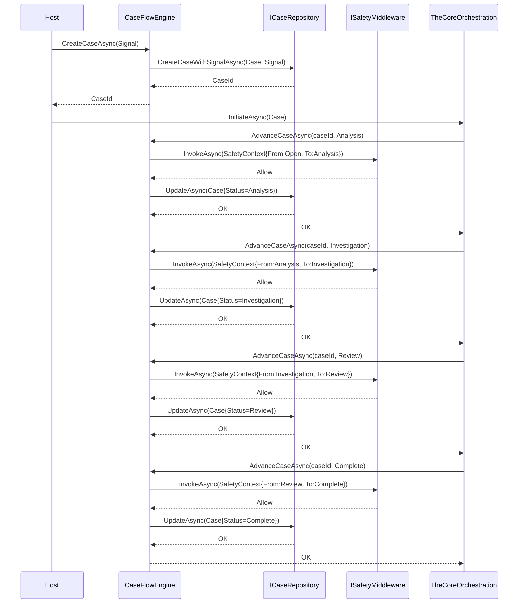

# Case Flow Engine Component

## 1. Purpose & Role

The **Case Flow Engine (CFE)** is the **single owner of case lifecycle state**. It owns the deterministic state machine that drives a case from `Open` through investigation to `Complete`, `Cancelled`, or `Closed`. It does not orchestrate agents, reason over evidence, or execute tools — it only advances state, persists records, and enforces invariants.

**Key principle:** The CFE is the *source of truth* for `CaseStatus`. No agent, orchestrator, or host may mutate case status directly.

**Role in the system:**

* **Single source of truth** for case state and progression.
* **Owner of the case lifecycle**: defines and enforces allowed states and transitions.
* **Coordinator of work**: requests actions from the Core/Manager agent pair but never performs reasoning itself.
* **Guardrail for scope**: prevents uncontrolled branching, looping, or state drift.

The CFE is _not_ an agent and does _not_ call LLMs directly. It is a deterministic state machine that manages the case state.

---

## 2. Responsibilities

- **Case creation** from a `Signal` (the triggering event)
- **State transitions** via `AdvanceCaseAsync(caseId, newStatus)` with validation
- **Persistence coordination** via `ICaseRepository`, `IEvidenceStore`, `ISignalRepository`, `IPatternMemoryStore`
- **Safety gating** via `ISafetyMiddleware` before state transitions
- **Evidence linkage** — every evidence item is tied to a `CaseRecordId`
- **Signal-to-case binding** — atomic creation of `Signal` + `Case` + FK link in one transaction

---

## 3. Core Abstractions (from `SentinelCore.Contracts`)

### `ICaseFlowEngine` (`SentinelCore.Contracts.CaseFlow.ICaseFlowEngine`)

```csharp
public interface ICaseFlowEngine
{
    Task<Guid> CreateCaseAsync(Signal signal, CancellationToken cancellationToken = default);
    Task AdvanceCaseAsync(Guid caseId, CaseStatus status, CancellationToken cancellationToken = default);
}
```

- `CreateCaseAsync(Signal)` → returns `Guid` (the `CaseId`). Creates `Case` with `Status = CaseStatus.Open`, persists `Signal` + `Case` atomically via `ICaseRepository.CreateCaseWithSignalAsync`.
- `AdvanceCaseAsync(Guid, CaseStatus)` → validates transition, updates `Case.Status` and `Case.UpdatedAt`, persists via `ICaseRepository.UpdateAsync`.

### `CaseStatus` (`SentinelCore.Contracts.CaseFlow.CaseStatus`)

**13-state deterministic lifecycle enum** (with XML docs on each value):

| Value | Ordinal | Meaning |
|-------|---------|---------|
| `Open` | 0 | Case created, awaiting analysis |
| `Analysis` | 1 | Core agent analyzing signal, building context |
| `Investigation` | 2 | Magnetic workflow executing (Manager + Workers) |
| `Review` | 3 | Aggregator reviewing magnetic output |
| `AwaitingInput` | 4 | Blocked on external input (user, external system) |
| `Escalated` | 5 | Escalated to human/on-call |
| `Alerted` | 6 | Alert fired (pager, ticket, webhook) |
| `Blocked` | 7 | Hard block (dependency, policy, safety) |
| `Complete` | 8 | Investigation complete, resolution drafted |
| `Cancelled` | 9 | Cancelled by user/system before completion |
| `Closed` | 10 | Fully closed, archived |

### `Case` (`SentinelCore.Contracts.CaseFlow.Case`)

Aggregate root for a case:

```csharp
public record Case
{
    public Guid Id { get; init; }                    // DB PK
    public Guid CaseId { get; init; }                // Business key (returned by CreateCaseAsync)
    public List<Evidence> EvidenceItems { get; init; } = [];
    public Signal? InitiatingSignal { get; init; }
    public Guid? PatternMemoryId { get; init; }
    public Guid? PlanId { get; init; }
    public List<Signal> Signals { get; init; } = [];
    public CaseStatus Status { get; set; } = CaseStatus.Open;
    public DateTime CreatedAt { get; init; } = DateTime.Now;
    public DateTime UpdatedAt { get; set; } = DateTime.Now;
}
```

### `Signal` (`SentinelCore.Contracts.CaseFlow.Signal`)

Triggering event that spawns a case:

```csharp
public record Signal
{
    public Guid Id { get; init; }
    public Guid SignalId { get; init; }
    public Guid? CaseRecordId { get; init; }
    public string SignalText { get; init; } = string.Empty;
    public string Source { get; init; } = string.Empty;
    public DateTime Timestamp { get; init; } = DateTime.Now;
}
```

### `Evidence` (`SentinelCore.Contracts.CaseFlow.Evidence`)

Evidence item attached to a case:

```csharp
public record Evidence
{
    public Case? Case { get; init; }
    public Guid CaseRecordId { get; init; }
    public string ContentJson { get; init; } = string.Empty;
    public Guid EvidenceId { get; init; }
    public Guid Id { get; init; }
    public string Provenance { get; init; } = string.Empty;
    public string Source { get; init; } = string.Empty;
    public DateTime Timestamp { get; init; } = DateTime.Now;
    public string Type { get; init; } = string.Empty;
}
```

### `InvestigationPlan` / `InvestigationPlanStep` (`SentinelCore.Contracts.CaseFlow`)

Plan container and steps produced by the Core agent during `Analysis` → `Investigation` transition:

```csharp
public record InvestigationPlan
{
    public Guid Id { get; init; }
    public Guid PlanId { get; init; }
    public List<InvestigationPlanStep> Steps { get; init; } = [];
    public Guid CaseId { get; init; }
}

public record InvestigationPlanStep
{
    public bool CompletedSuccessfully { get; set; }
    public Guid Id { get; init; }
    public string Instruction { get; init; } = string.Empty;
    public bool IsTargetPropertyMissing { get; set; }
    public Guid OperationId { get; init; }
    public InvestigationPlan? Plan { get; init; }
    public Guid PlanId { get; init; }
    public string Result { get; set; } = string.Empty;
    public Guid StepId { get; init; }
    public string Surface { get; init; } = string.Empty;
    public bool TaskBlocked { get; set; }
}
```

### `Resolution` (`SentinelCore.Contracts.CaseFlow.Resolution`)

Case resolution record:

```csharp
public record Resolution
{
    public Guid CaseRecordId { get; init; }
    public Guid Id { get; init; }
    public string Notes { get; init; } = string.Empty;
    public string RawJsonContent { get; init; } = string.Empty;
    public bool Verified { get; init; }
}
```

### `PatternMemory` (`SentinelCore.CaseFlowEngine.CaseFlow.PatternMemory`)

Vector similarity record for pattern matching across cases:

```csharp
public record PatternMemory
{
    public Case? Case { get; init; }
    public Guid CaseId { get; init; }
    public Guid Id { get; init; }
    public Guid PatternId { get; init; }
    public List<float> SignalEmbedding { get; init; } = [];
    public List<float> SummaryEmbedding { get; init; } = [];
    public DateTime Timestamp { get; init; } = DateTime.Now;
}
```

---

## 4. Persistence Layer (EF Core — `SentinelCore.CaseFlowEngine.Persistence`)

### `SentinelCoreDbContext`

EF Core `DbContext` with 7 `DbSet`s:

```csharp
public DbSet<CaseEntity> Cases { get; set; }
public DbSet<EvidenceEntity> Evidence { get; set; }
public DbSet<SignalEntity> Signals { get; set; }
public DbSet<InvestigationPlanEntity> InvestigationPlans { get; set; }
public DbSet<InvestigationPlanStepsEntity> InvestigationPlanSteps { get; set; }
public DbSet<PatternMemoryEntity> PatternMemories { get; set; }
public DbSet<ResolutionEntity> Resolutions { get; set; }
```

- SQL Server provider (`UseSqlServer`)
- `SqlVector<float>` for `SignalEmbedding` / `SummaryEmbedding` on `PatternMemoryEntity` (vector similarity search)
- FK relationships: `CaseEntity` 1→N `EvidenceEntity`, `SignalEntity`, `InvestigationPlanEntity`, `PatternMemoryEntity`, `ResolutionEntity`

### Entity Mappings (all in `SentinelCore.CaseFlowEngine.Persistence`)

| Entity | Table | Key | Notable |
|--------|-------|-----|---------|
| `CaseEntity` | `Cases` | `Id` (PK), `CaseRecordId` (unique) | `CaseId` business key, `Status` (int), navigation to all children |
| `EvidenceEntity` | `Evidence` | `Id` (PK) | FK → `CaseEntity.CaseRecordId`, `ContentJson` (nvarchar(max)) |
| `SignalEntity` | `Signals` | `Id` (PK) | FK → `CaseEntity.CaseRecordId`, `SignalText`, `Source` |
| `InvestigationPlanEntity` | `InvestigationPlans` | `Id` (PK) | FK → `CaseEntity.CaseRecordId`, 1→N `InvestigationPlanStepsEntity` |
| `InvestigationPlanStepsEntity` | `InvestigationPlanSteps` | `Id` (PK) | `Surface`, `Instruction`, `Result`, `CompletedSuccessfully`, `TaskBlocked`, `IsTargetPropertyMissing` |
| `PatternMemoryEntity` | `PatternMemories` | `Id` (PK) | `SignalEmbedding` (`SqlVector<float>`), `SummaryEmbedding` (`SqlVector<float>`) |
| `ResolutionEntity` | `Resolutions` | `Id` (PK) | FK → `CaseEntity.CaseRecordId`, `RawJsonContent`, `Notes`, `Verified` |

---

## 5. Repository Abstractions (from `SentinelCore.Contracts.Abstractions`)

| Interface | Purpose | Key Methods |
|-----------|---------|-------------|
| `ICaseRepository` | Case persistence | `CreateAsync`, `CreateCaseWithSignalAsync`, `GetByIdAsync`, `ListAsync`, `UpdateAsync` |
| `IEvidenceStore` | Evidence persistence | `AddAsync`, `GetByCaseIdAsync` |
| `ISignalRepository` | Signal persistence | `AddAsync`, `AssignToCaseAsync` |
| `IPatternMemoryStore` | Vector similarity search | `SearchAsync(vector, topK)`, `StoreAsync(PatternMemory)`, `GetByCaseIdAsync` |

---

## 6. Implementation (`SentinelCore.CaseFlowEngine.CaseFlow.CaseFlowEngine`)

```csharp
public class CaseFlowEngine : ICaseFlowEngine
{
    private readonly ICaseRepository _caseRepository;
    private readonly ISignalRepository _signalRepository;
    private readonly IEvidenceStore _evidenceStore;
    private readonly IPatternMemoryStore _patternMemoryStore;
    private readonly ISafetyMiddleware _safetyMiddleware;

    public async Task<Guid> CreateCaseAsync(Signal signal, CancellationToken ct = default)
    {
        var caseId = Guid.NewGuid();
        var caseRecord = new Case
        {
            CaseId = caseId,
            Status = CaseStatus.Open,
            InitiatingSignal = signal,
            CreatedAt = DateTime.Now,
            UpdatedAt = DateTime.Now
        };
        await _caseRepository.CreateCaseWithSignalAsync(caseRecord, signal, ct);
        return caseId;
    }

    public async Task AdvanceCaseAsync(Guid caseId, CaseStatus status, CancellationToken ct = default)
    {
        var caseRecord = await _caseRepository.GetByIdAsync(caseId, ct);
        if (caseRecord == null) throw new InvalidOperationException($"Case {caseId} not found");

        // TODO: Validate transition (CaseStatusTransitionValidator)
        // TODO: Safety gate via _safetyMiddleware

        caseRecord.Status = status;
        caseRecord.UpdatedAt = DateTime.Now;
        await _caseRepository.UpdateAsync(caseRecord, ct);
    }
}
```

**Current implementation status:**
- ✅ `CreateCaseAsync` — fully implemented with atomic `Signal`+`Case` persistence
- ❌ `AdvanceCaseAsync` — **throws `NotImplementedException`** (transition validation + safety gating TODO)

---

## 7. Safety Integration

- `ISafetyMiddleware` (from `SentinelCore.Contracts.SafetyEngine`) is injected into `CaseFlowEngine`
- **TODO:** Before any `AdvanceCaseAsync` transition, invoke `_safetyMiddleware.InvokeAsync(context, next)` with `SafetyContext` containing `CaseId`, `FromStatus`, `ToStatus`, `Actor`
- `SafetyVerdict.Allow` → proceed; `SafetyVerdict.Deny` / `SafetyVerdict.Escalate` → throw / transition to `Escalated` / `Blocked`

---

## 8. Contracts & Invariants

| Invariant | Enforcement |
|-----------|-------------|
| Single source of truth for `CaseStatus` | Only `CaseFlowEngine.AdvanceCaseAsync` mutates `Case.Status` |
| Atomic `Signal`+`Case` creation | `ICaseRepository.CreateCaseWithSignalAsync` uses single transaction |
| Evidence always linked to valid `CaseRecordId` | FK constraint in DB; `Evidence.CaseRecordId` required |
| `CaseStatus` transitions validated | **TODO:** `CaseStatusTransitionValidator` (transition matrix) |
| Safety gate before transition | **TODO:** `ISafetyMiddleware` integration in `AdvanceCaseAsync` |
| `CaseId` (business key) immutable | `Case.CaseId` init-only; `CaseRecordId` is DB PK |

---

## 9. Interaction Diagram (Logical)



---

## 10. Configuration (`SentinelCoreSettings`)

From `SentinelCore.Contracts.Contracts.SentinelCoreSettings`:

```csharp
public class SentinelCoreSettings
{
    public ModelSettings CoreModel { get; set; } = new();
    public ModelSettings ManagerModel { get; set; } = new();
    public ModelSettings DomainModel { get; set; } = new();
    public ModelSettings DefaultModel { get; set; } = new();
    public OrchestrationType OrchestrationType { get; set; } = OrchestrationType.TheCore;
    public string SqlConnectionString { get; set; } = string.Empty;
    public bool TraceEnabled { get; set; } = true;
}
```

- `SqlConnectionString` → `SentinelCoreDbContext` via `SentinelCoreBuilder`
- `OrchestrationType` → selects `ISentinelWorkflow` implementation via `IOrchestrationFactory`

---

## 11. Open TODOs / Known Gaps

| Item | Location | Status |
|------|----------|--------|
| `CaseStatusTransitionValidator` (transition matrix) | `CaseFlowEngine.AdvanceCaseAsync` | ❌ Not implemented |
| `ISafetyMiddleware` integration in `AdvanceCaseAsync` | `CaseFlowEngine` | ❌ Not implemented |
| `AdvanceCaseAsync` full implementation | `CaseFlowEngine.cs` | ❌ Throws `NotImplementedException` |
| `IPatternMemoryStore.SearchAsync` vector similarity impl | `PatternMemoryStore` | ❌ Not implemented |
| `ICaseRepository.ListAsync` pagination/filtering | `CaseRepository` | ❌ Not implemented |
| Transition audit log (immutable history) | New entity/table | ❌ Not designed |

---

## 12. Related Components

| Component | Relationship |
|-----------|--------------|
| `OrchestrationComponent` | `TheCoreOrchestration` calls `ICaseFlowEngine.AdvanceCaseAsync` at each phase transition |
| `SafetyRailsComponent` | Provides `ISafetyMiddleware` for transition gating |
| `MemoryLayerComponent` | Provides `IPatternMemoryStore` for pattern memory persistence/search |
| `ToolingComponent` | Domain tools may add `Evidence` via `IEvidenceStore` during investigation |
| `DomainAgentSurfaces` | Domain agents produce `Evidence`/`InvestigationPlanStep.Result` persisted via CFE repos |
