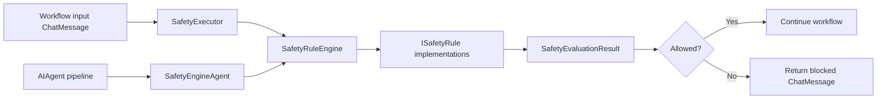

# SentinelCore Safety Engine Component

**Project:** `SentinelCore.Orchestrations`
**Namespace:** `SentinelCore.Orchestrations.SafetyEngine`
**Primary caller:** `SentinelCore.Orchestrations.Workflows.Executors.SafetyExecutor`
**Primary middleware path:** `SafetyEngineAgent`
**Related rules:** `SentinelCore.Orchestrations.SafetyEngine.Rules.*`

## Purpose

The Safety Engine evaluates a prompt against configured safety rules before the prompt is allowed to continue through the orchestration workflow. It is a rule-based, fail-safe subsystem that returns structured results and can block unsafe content.

The current implementation has two layers:

1. `SafetyEngineAgent`, which evaluates prompts as middleware in the agent pipeline.
2. `SafetyExecutor`, which is a workflow executor that calls the safety engine and reacts to the resulting safety verdict.

## Current Architectural Role

The executor does not implement the engine itself. It invokes the engine and forwards the result into the workflow graph.

This is the intended split today:

- `SafetyExecutor` is the workflow step.
- `SafetyRuleEngine` evaluates the configured rules.
- `SafetyEngineAgent` is the middleware adapter used by the agent pipeline.
- `BlocklistRule` and the other rules provide the rule-level verdicts.

## Current Runtime Flow



## Contracts

### `ISafetyRule`

Rules are implemented in [SafetyEngine/ISafetyRule.cs](../projects/SentinelCore.Orchestrations/SafetyEngine/ISafetyRule.cs).

```csharp
Task<SafetyRuleResult> EvaluateAsync(SafetyEvaluationContext context, CancellationToken cancellationToken = default);
```

Rules are stateless. They inspect `SafetyEvaluationContext` and return a `SafetyRuleResult`.

### `SafetyEvaluationContext`

The evaluation context provides the input messages and convenience accessors such as `CombinedText`.

### `SafetyRuleResult`

Each rule returns one of the shared outcomes:

- `Allow`
- `Warn`
- `Block`

The result carries the rule name, severity, and reason.

### `SafetyEvaluationResult`

The engine aggregates rule results into a single evaluation object with:

- `IsAllowed`
- `HighestSeverity`
- `Summary`
- `BlockingResult`
- `RuleResults`

## Engine Behavior Today

### `SafetyRuleEngine`

`SafetyRuleEngine` is the canonical engine implementation. It evaluates all registered rules in order and returns a `SafetyEvaluationResult`.

Current behavior:

- Executes each rule sequentially.
- Short-circuits when configured to stop on first block.
- Treats rule failures as blocks by default.
- Emits logging through its internal logger factory.

### `SafetyEngineAgent`

`SafetyEngineAgent` is the middleware-facing adapter that:

- evaluates the same rule set,
- attaches the `SafetyEvaluationResult` into `AgentRunOptions.AdditionalProperties`,
- returns a blocked response when the evaluation fails,
- forwards allowed prompts to the inner agent.

## Workflow Executor Behavior

### `SafetyExecutor`

`SafetyExecutor` is a workflow executor that calls the engine and does not own the safety policy itself.

Current behavior:

- Validates null input and reports through `ISystemReporter`.
- Builds a `SafetyEvaluationContext` from the incoming `ChatMessage`.
- Calls `SafetyRuleEngine.EvaluateAsync(...)`.
- Returns a blocked assistant message when `IsAllowed` is false.
- Returns the original message when the evaluation passes.

It is intentionally a caller of the safety engine, not the engine implementation.

## Rule Source

`BlocklistRule` is currently the primary safety rule that uses `SafetyTriggerTerms.GetAllIndicators()` plus compatibility overloads for explicit indicator or string lists.

This file is still the place to evolve the rule vocabulary, but the engine contract remains the shared `ISafetyRule` / `SafetyRuleResult` model.

## Template Alignment

Workflow executors should follow the conventions in [ExecutorTemplate.cs](../projects/SentinelCore.Orchestrations/Workflows/Executors/ExecutorTemplate.cs):

- class extends `Executor`
- `[YieldsOutput(typeof(...))]`
- `[MessageHandler]` on the handler method
- conventional constructor
- `ISystemReporter` for executor output
- `ProcessMessageAsync` for domain logic

`SafetyExecutor` now follows that pattern for its logging/output flow and delegates safety evaluation to the engine.

## Known Gaps

The current implementation is functional, but these items remain unresolved relative to the earlier design proposal:

- No dedicated `SafetyReviewerExec` exists yet.
- No threshold-based scoring pipeline exists in the executor.
- `BlocklistRule` still behaves as a compatibility blocklist rule rather than a weighted scoring engine.
- Conditional review/critical branches are not present in the workflow graph.

## Documentation Scope

This document is the canonical reference for the current safety-engine implementation. It is aligned to what exists in the repository today, not to future proposed behavior.
