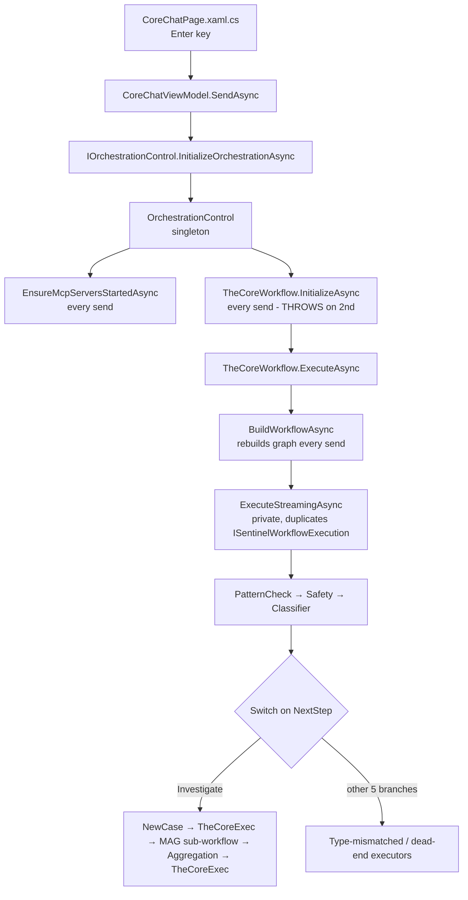

Ran terminal command: Get-Content "f:\Solutions\SentinelCore\SentinelCore\projects\SentinelCore.Orchestrations\Workflows\Executors\PatternCheckExecutor.cs" -Raw | Out-File "$env:TEMP\pattern.txt"; $raw = Get-Content "$env:TEMP\pattern.txt" -Raw; Write-Host "Length: $($raw.Length)"; $raw.Substring(0, [Math]::Min(5500, $raw.Length))

Ran terminal command: Get-Content "f:\Solutions\SentinelCore\SentinelCore\projects\SentinelCore.Contracts\Events\ISentinelCoreEvents.cs" -Raw | Out-File "$env:TEMP\events.txt"; Get-Content "f:\Solutions\SentinelCore\SentinelCore\projects\SentinelCore.Contracts\Events\SentinelCoreEvents.cs" -Raw | Out-File "$env:TEMP\eventsimpl.txt"; $raw1 = Get-Content "$env:TEMP\events.txt" -Raw; Write-Host "=== ISentinelCoreEvents (len $($raw1.Length)) ==="; $raw1.Substring(0, [Math]::Min(3000, $raw1.Length)); $raw2 = Get-Content "$env:TEMP\eventsimpl.txt" -Raw; Write-Host "=== SentinelCoreEvents (len $($raw2.Length)) ==="; $raw2.Substring(0, [Math]::Min(3500, $raw2.Length))

Ran terminal command: Get-Content "f:\Solutions\SentinelCore\SentinelCore\projects\SentinelCore.Orchestrations\Application\SentinelWorkflowExecution.cs" -Raw | Out-File "$env:TEMP\swfe.txt"; Get-Content "f:\Solutions\SentinelCore\SentinelCore\projects\SentinelCore.Orchestrations\Application\WorkflowExecutionResult.cs" -Raw | Out-File "$env:TEMP\wfer.txt"; Write-Host "=== SentinelWorkflowExecution ==="; Get-Content "$env:TEMP\swfe.txt" -Raw; Write-Host "=== WorkflowExecutionResult ==="; Get-Content "$env:TEMP\wfer.txt" -Raw

Ran terminal command: $raw = Get-Content "c:\Users\TommyCat\AppData\Roaming\Code\User\workspaceStorage\e0c3e1efd2f5985602ce7771cc11c8b4\GitHub.copilot-chat\chat-session-resources\5517f75f-6a43-4bee-aa02-21c237350170\call_a2c7sm22__vscode-1789670563137\content.txt" -Raw; $raw.Substring(0, [Math]::Min(5000, $raw.Length))

Ran terminal command: $raw = Get-Content "c:\Users\TommyCat\AppData\Roaming\Code\User\workspaceStorage\e0c3e1efd2f5985602ce7771cc11c8b4\GitHub.copilot-chat\chat-session-resources\5517f75f-6a43-4bee-aa02-21c237350170\call_a2c7sm22__vscode-1789670563137\content.txt" -Raw; $raw.Substring(5000, [Math]::Min(5500, $raw.Length - 5000))

Ran terminal command: $raw = Get-Content "c:\Users\TommyCat\AppData\Roaming\Code\User\workspaceStorage\e0c3e1efd2f5985602ce7771cc11c8b4\GitHub.copilot-chat\chat-session-resources\5517f75f-6a43-4bee-aa02-21c237350170\call_a2c7sm22__vscode-1789670563137\content.txt" -Raw; $raw.Substring(10500, [Math]::Min(6500, $raw.Length - 10500))

Ran terminal command: Get-Content "f:\Solutions\SentinelCore\SentinelCore\projects\SentinelCore.Orchestrations\Workflows\SignalHypothesis.cs" -Raw; Write-Host "=== CoreRoutingDecision ==="; Get-Content "f:\Solutions\SentinelCore\SentinelCore\projects\SentinelCore.Orchestrations\Workflows\CoreRoutingDecision.cs" -Raw; Write-Host "=== DirectAnswerExecutor ==="; Get-Content "f:\Solutions\SentinelCore\SentinelCore\projects\SentinelCore.Orchestrations\Workflows\Executors\DirectAnswerExecutor.cs" -Raw

Ran terminal command: Get-Content "f:\Solutions\SentinelCore\SentinelCore\projects\SentinelCore.Orchestrations\Workflows\Executors\NewCaseExecutor.cs" -Raw | Out-File "$env:TEMP\newcase.txt"; $raw = Get-Content "$env:TEMP\newcase.txt" -Raw; Write-Host "Length: $($raw.Length)"; $raw.Substring(0, [Math]::Min(6000, $raw.Length))

Ran terminal command: Get-Content "f:\Solutions\SentinelCore\SentinelCore\projects\SentinelCore.Orchestrations\Workflows\Executors\AggregationExecutor.cs" -Raw | Out-File "$env:TEMP\agg.txt"; $raw = Get-Content "$env:TEMP\agg.txt" -Raw; Write-Host "Length: $($raw.Length)"; $raw.Substring(0, [Math]::Min(5500, $raw.Length))

Ran terminal command: Get-Content "f:\Solutions\SentinelCore\SentinelCore\projects\SentinelCore.Orchestrations\Workflows\Executors\HumanOperatorExecutor.cs" -Raw | Out-File "$env:TEMP\human.txt"; Get-Content "f:\Solutions\SentinelCore\SentinelCore\projects\SentinelCore.Orchestrations\Workflows\Executors\MoreInformationExecutor.cs" -Raw | Out-File "$env:TEMP\moreinfo.txt"; Get-Content "f:\Solutions\SentinelCore\SentinelCore\projects\SentinelCore.Orchestrations\Workflows\Executors\EscalatedExecutor.cs" -Raw | Out-File "$env:TEMP\escalated.txt"; Get-Content "f:\Solutions\SentinelCore\SentinelCore\projects\SentinelCore.Orchestrations\Workflows\Executors\CriticalAlert.cs" -Raw | Out-File "$env:TEMP\critical.txt"; Write-Host "=== HumanOperator ==="; Get-Content "$env:TEMP\human.txt" -Raw; Write-Host "=== MoreInformation ==="; Get-Content "$env:TEMP\moreinfo.txt" -Raw

Ran terminal command: Write-Host "=== EscalatedExecutor ==="; Get-Content "$env:TEMP\escalated.txt" -Raw; Write-Host "=== CriticalAlert ==="; Get-Content "$env:TEMP\critical.txt" -Raw

Ran terminal command: Get-Content "f:\Solutions\SentinelCore\SentinelCore\projects\SentinelCore.Orchestrations\Infrastructure\DependencyInjection\ExecutorRegistration.cs" -Raw; Write-Host "=== CaseGenExec ==="; Get-Content "f:\Solutions\SentinelCore\SentinelCore\projects\SentinelCore.Orchestrations\Workflows\Executors\CaseGenExec.cs" -Raw | Out-File "$env:TEMP\casegen.txt"; $raw = Get-Content "$env:TEMP\casegen.txt" -Raw; Write-Host "Length: $($raw.Length)"; $raw.Substring(0, [Math]::Min(4000, $raw.Length))

Ran terminal command: Get-Content "f:\Solutions\SentinelCore\SentinelCore\projects\SentinelCore.UI\Views\CoreChatPage.xaml.cs" -Raw; Write-Host "=== MainWindow.xaml.cs (first 80 lines) ==="; Get-Content "f:\Solutions\SentinelCore\SentinelCore\projects\SentinelCore.UI\MainWindow.xaml.cs" | Select-Object -First 80 | Out-String -Width 250

Ran terminal command: Get-Content "f:\Solutions\SentinelCore\SentinelCore\projects\SentinelCore.Orchestrations\Workflows\CustomGroup.cs" -Raw | Out-File "$env:TEMP\customgroup.txt"; $raw = Get-Content "$env:TEMP\customgroup.txt" -Raw; Write-Host "Length: $($raw.Length)"; $raw.Substring(0, [Math]::Min(5000, $raw.Length))

Ran terminal command: Get-Content "f:\Solutions\SentinelCore\SentinelCore\projects\SentinelCore.Orchestrations\Agents\Middleware\EventPublishingChatClient.cs" -Raw | Out-File "$env:TEMP\epcc.txt"; $raw = Get-Content "$env:TEMP\epcc.txt" -Raw; Write-Host "Length: $($raw.Length)"; $raw.Substring(0, [Math]::Min(5500, $raw.Length))

Ran terminal command: Get-Content "f:\Solutions\SentinelCore\SentinelCore\projects\SentinelCore.Orchestrations\Workflows\Executors\WorkFlowStateKeys.cs" -Raw; Write-Host "=== LoggingExecutor ==="; Get-Content "f:\Solutions\SentinelCore\SentinelCore\projects\SentinelCore.Orchestrations\Workflows\Executors\LoggingExecutor.cs" -Raw

I have the full chain now. Let me verify a few remaining details — the `Throw` helper, `ISystemReporter` location, `NavigationService` disposal behavior, and the UI project references. 

Ran terminal command: Get-ChildItem -Path "f:\Solutions\SentinelCore\SentinelCore\projects" -Recurse -Filter "*.csproj" | Select-Object -ExpandProperty FullName; Write-Host "=== UI csproj ==="; Get-Content "f:\Solutions\SentinelCore\SentinelCore\projects\SentinelCore.UI\SentinelCore.UI.csproj" -Raw

Ran terminal command: Select-String -Path "f:\Solutions\SentinelCore\SentinelCore\projects\SentinelCore.UI\ViewModels\CoreChatViewModel.cs" -Pattern "OnSentinelOutput|OnErrorOccurred|StatusMessage" | Out-String -Width 250; Write-Host "=== NavigationService ==="; Get-Content "f:\Solutions\SentinelCore\SentinelCore\projects\SentinelCore.UI\Services\NavigationService.cs" -Raw | Out-File "$env:TEMP\nav.txt"; $raw = Get-Content "$env:TEMP\nav.txt" -Raw; Write-Host "Length: $($raw.Length)"; $raw.Substring(0, [Math]::Min(4500, $raw.Length))

Ran terminal command: Get-ChildItem -Path "f:\Solutions\SentinelCore\SentinelCore\projects\SentinelCore.Contracts" -Recurse -Filter "*.cs" | Where-Object { $_.FullName -notmatch '\\obj\\|\\bin\' } | Select-Object -ExpandProperty FullName | Out-String -Width 250

Ran terminal command: Get-Content "f:\Solutions\SentinelCore\SentinelCore\projects\SentinelCore.Contracts\Contracts\SentinelCoreSettings.cs" -Raw; Write-Host "=== OrchestrationType ==="; Get-Content "f:\Solutions\SentinelCore\SentinelCore\projects\SentinelCore.Contracts\Contracts\OrchestrationType.cs" -Raw

I've traced the complete call chain. Here is the architectural review.

---

# Architecture Review: UI → `TheCoreWorkflow` Call Chain

## 1. Decision Summary

**Scope reviewed:** `CoreChatPage` → `CoreChatViewModel.SendAsync` → `IOrchestrationControl.InitializeOrchestrationAsync` → `OrchestrationFactory` → `TheCoreWorkflow.InitializeAsync` / `ExecuteAsync` → executor graph → `WorkflowExecutionResult` → UI, plus the supporting cast: DI composition, `SentinelAgentFactory`, `WorkflowBase`, `SentinelWorkflowExecution`, event hub, and terminal executors.

**Verdict:** The layering *shape* (UI → Application facade → Orchestration → Executors) is sound, but the chain contains **one show-stopping behavioral defect**, **pervasive type incoherence in the workflow graph**, and **multiple violations of the repository's own pattern-lock** (`drift-prevention.instructions.md`). The chain works for exactly one message on the Investigate path; every other path is either broken or silent.

---

## 2. Observed Principle Violations

### 2.1 Critical (breaks the chain at runtime)

| # | Problem | Evidence |
|---|---------|----------|
| **C1** | **Second chat message always fails.** `OrchestrationControl.InitializeOrchestrationAsync` calls `_orchestration.InitializeAsync(token)` on *every* send, but `TheCoreWorkflow.InitializeAsync` throws `InvalidOperationException` when `_isInitialized` is true. The comment "Initialize agents once (idempotent - will throw if called twice)" is self-contradictory — idempotent means safe to re-call. Every send after the first surfaces "Request failed: 'TheCoreWorkflow' has already been initialized." | `OrchestrationControl.cs` L~100; `TheCoreWorkflow.cs` `InitializeAsync` |
| **C2** | **Workflow graph is type-incoherent.** The classifier emits `SignalHypothesis`, but 4 of 6 switch targets declare `Executor<string, string>` (`CriticalAlert`, `MoreInformationExecutor`, `EscalatedExecutor`) or `Executor<ChatMessage>` (`HumanOperatorExecutor` default). The loop-back edge `AggregationExecutor` (`ChatMessage` out) → `TheCoreExec` (`SignalHypothesis` in) also mismatches. MAF routes by declared message type; these branches silently drop or misroute. | `TheCoreWorkflow.BuildWorkflow` vs. executor declarations |
| **C3** | **Terminal branches produce no user-visible output.** `HumanOperatorExecutor`, `MoreInformationExecutor`, `EscalatedExecutor`, and `CriticalAlert` never call `YieldOutputAsync` and return `default`. RedAlert / Escalate / MoreInfo routes end with `WorkflowExecutionResult = null` — the user's message vanishes with no reply in chat. | Executor files; `CoreChatViewModel.SendAsync` renders nothing for `null` |
| **C4** | **`DirectAnswerExecutor` NRE path.** When `agResponse == null` it yields "I am unable to provide a response" but does not return — execution falls through to `agResponse.Text` → `NullReferenceException`. | `DirectAnswerExecutor.HandleAnswerAsync` |
| **C5** | **Classifier failure escalates as a critical alert.** `ClassifierAgentExec` catches *all* exceptions (including `OperationCanceledException`, breaking cooperative cancellation) and returns `new SignalHypothesis()` whose default `NextStep = RedAlert` (enum value 0). A transient model error or user cancel is indistinguishable from a critical security event. | `ClassifierAgentExec.HandleAsync`; `CoreRoutingDecision.cs` enum ordering |

### 2.2 Violations of the repository's own pattern-lock

| # | Rule (from `drift-prevention.instructions.md` / copilot-instructions) | Violation |
|---|----------------------------------------------------------------------|-----------|
| **P1** | *"Never use `Console.WriteLine` for agent or workflow output"* | `TheCoreWorkflow.VisualizeWorkflow` does `Console.WriteLine(flow)`; `CustomGroupWorkflow.ExecuteAsync` logs responses via `Console.WriteLine` (twice, duplicated). |
| **P2** | *"❌ `services.AddLogging()` inside the library — the host owns logging"* | `SentinelCoreServiceExtensions.JsonConfiguredLogging` calls `services.AddLogging(...)` adding console + JSON providers and `LogLevel.Trace`. The host then calls `ClearProviders()` in `ConfigureLogging` — the library's logging config is both a prohibited act *and* dead code. |
| **P3** | *"❌ Registering `ICaseFlowEngine` unconditionally (depends on optional persistence)"* | `AddSentinelCore` unconditionally registers `ICaseFlowEngine`, `IEvidenceStore`, `IPatternMemoryStore`; the UI hardwires `AddDbContextFactory<SentinelCoreDBContext>`. CFE is documented as an optional component with clean seams — it is currently inseparable. The `TODO` in `OrchestrationControl` and `App.xaml.cs` acknowledges this. |
| **P4** | *"Each type has exactly one canonical location"* | `TheCoreWorkflow` is registered **twice with conflicting lifetimes**: `AddTransient<IOrchestration, TheCoreWorkflow>()` and `AddSingleton<TheCoreWorkflow>()`. Anything resolving `IOrchestration` gets a fresh, uninitialized instance whose `BuildWorkflow` throws on null agents. `IOrchestrationControl` is registered twice. `DirectAnswerExecutor` is registered twice in `ExecutorRegistration`. `NewCaseExecutor` is registered explicitly *and* via `RegisterExecutors()`. |
| **P5** | *"All agent output flows through `ISentinelCoreEvents`"* — plus the documented mandate that *"All orchestration classes should delegate workflow execution to `SentinelWorkflowExecution`"* | `TheCoreWorkflow` implements its own private `ExecuteStreamingAsync` loop instead of delegating to the injected-and-registered `ISentinelWorkflowExecution`. `OrchestrationControl` injects `ISentinelWorkflowExecution` and **never uses it** — a dead dependency proving the intended delegation was abandoned. Two divergent event-processing pipelines now exist (`WorkflowBase.ProcessEvent` + `PublishIntermediateEventAsync` vs. `SentinelWorkflowExecution.ProcessEvent`). |
| **P6** | Middleware preset contract (`AgentMiddlewarePipeline`: Core gets Safety + PatternMemory; Manager gets none) | `SentinelAgentFactory` ignores `AgentMiddlewarePipeline` entirely. `ApplyBuilderMiddleware` applies the safety engine to **every** agent — with an **empty rule list** (`CreateSafetyRules()` returns `new List<ISafetyRule>()`), making it a universal no-op. `PatternMemoryInjector` is applied to no one. Documented pipeline and implementation have fully drifted. |
| **P7** | Namespace must match folder path; root `SentinelCore.*` | `Contracts\Abstractions\*` uses namespace `SentinelCore.Abstractions` (missing project segment); `SentinelCore.Contracts.Contracts` stutters; three competing CFE namespaces (`SentinelCore.Cfe`, `SentinelCore.Contracts.Cfe`, `SentinelCore.CaseFlowEngine.Cfe`). |

### 2.3 Structural / design flaws

1. **Dual, contradictory safety enforcement.** Workflow-level `SafetyExecutor` hardcodes 13 rules and **ignores `SafetyEngineSettings`** entirely (custom blocklists, `IsEnabled`, rate limiting are dead config). Agent-level `SafetyEngineAgent` middleware runs with zero rules. `TreatRuleErrorsAsBlocks = true` is configured in one place; `SafetyExecutor` catch-all swallows rule errors and **passes the message through** (fail-open). Two engines, zero shared configuration, inconsistent failure semantics — the security posture is incoherent. Bonus: the hardcoded blocklist blocks the word *"exploit"* in a security-investigation product.

2. **`TheCoreWorkflow` is a stateful singleton pretending to be a service.** Mutable agent fields, `_isInitialized` flag, shared `_responseAccumulators` (in `WorkflowBase`, cleared per-run via `ResetEventAccumulators()` — corrupts under any concurrency), non-atomic partial initialization (a failure mid-`InitializeAsync` leaves agents set but `_isInitialized = false`; retry leaks the first agent batch). No concurrency guard exists below the VM's `IsBusy`.

3. **Graph rebuilt per message.** `ExecuteAsync` → `BuildWorkflowAsync` reconstructs all executors, the MAG sub-workflow, and the routing graph on every send, then `VisualizeWorkflow` fire-and-forgets two file writes (`workflow.dot`, `workflow.mermaid` — containing DOT syntax) into the **current working directory** with `CancellationToken.None` and unobserved exceptions. Per-send I/O + unowned file locations.

4. **Service locator creep.** `TheCoreWorkflow` injects `IServiceProvider` and news up an internal `ExecutorFactory` (itself `ActivatorUtilities`-based) — while executors are *also* DI-registered. Three construction paths coexist: DI resolution, `ActivatorUtilities.CreateInstance`, and manual `new` (agent executors are manually constructed in `BuildWorkflow`, bypassing the factory pattern the non-agent executors use). `OrchestrationFactory` exists only to switch over an enum via `IServiceProvider` — a strategy lookup would be declarative.

5. **Dead code and dead dependencies throughout the chain:** `TheCoreWorkflow` injects `IAgentProfileBuilder` (validated, never stored); `_directAnswerAgent` is built (from the *"Classifier"* preset, semantically wrong) and never used — `DirectAnswerExecutor` instead receives the **Core agent**, i.e., direct answers run through the persistent-session Core agent configured with a `CoreDirective` JSON-schema response format, so the chat receives schema-constrained JSON rather than natural text. `CaseGenExec` runs an agent and **discards the response**. `CriticalAlert` injects `ICaseFlowEngine` and never calls it. `EscalatedExecutor`'s secondary constructor ignores both of its parameters. `AggregationExecutor` builds an unused `StringBuilder` and is a pass-through. `WorkflowFinished` record, `JsonOptions`, `OrchestrationEvent` channel, `LoggingExecutor`/`WhiteListExecutor`/`VerifyEvidenceExecutor`/`AnalysisExecutor`/`ClarificationExecutor`/`PersistEvidence` — registered, never wired.

6. **`NewCaseExecutor` fail-open on persistence.** Exceptions are swallowed and the workflow continues with **no `CASE_ID` in shared state** — downstream executors read a null case id. `HandleValidationFailure` advances `Guid.Empty` (guaranteed no-op landmine); `IsHypothesisValid` is never called; `prmpt` is read and unused.

7. **Placeholder executors leak fake data into the real UI.** `PatternCheckExecutor` yields `ChatMessage(User, "Pattern Match Found")` unconditionally — this lands in `WorkflowExecutionResult.OutputMessages` and is rendered in the chat as if it were real output. It also duplicates the `PROMPT` state write already done by `ClassifierAgentExec`.

8. **Threading contract is undefined.** `ISentinelCoreEvents` uses synchronous `Action<>` multicast delegates raised from background streaming threads. `CoreChatViewModel.OnSentinelOutput`/`OnErrorOccurred` set `ObservableProperty` values directly from those threads (WPF auto-marshals scalar bindings today; any future collection touch crashes). `PublishIntermediateEventAsync` is named `Async` but returns `void` — violates the repo's own `Async` suffix convention.

9. **Abstraction layering is inverted inside Orchestrations.** `IOrchestration` and `IOrchestrationControl` (in `Abstractions/`) reference `WorkflowExecutionResult` (in `Application/`) — the abstraction depends on the application layer. `IOrchestration.BuildWorkflow()` also leaks MAF `Workflow` through the orchestration seam. The UI must reference `SentinelCore.Orchestrations.Application` + `Abstractions` directly because the seam isn't in Contracts — violating the clean-seams mandate for the optional-component boundary.

10. **`WorkflowExecutionResult` has three constructors**, one public parameterless (breaks encapsulation — the UI could fabricate results), one that accepts an `eventLog` parameter and silently drops it. `WorkflowEventEntry.Timestamp` is documented "UTC" but uses `DateTime.Now`.

11. **`SentinelAgentFactory` hygiene:** `public Dictionary<string,string> ActiveAgents` — a public mutable field on a singleton; optional constructor fallbacks (`new AgentPresetProvider()`, `new AgentProfileBuilder(Options.Create(new SentinelCoreSettings()))`) silently build profiles against **empty settings**, masking DI misconfiguration; interface declares `ChatResponseFormat responseFormat = null` without `?` while the implementation uses `ChatResponseFormat?` — nullability drift.

12. **Composition root issues (`App.xaml.cs`):** registers a bare `CancellationToken` service (any component injecting `CancellationToken` silently receives the shutdown token); constructs `FileModelConfigStore` with `NullLogger` outside DI and performs file I/O *during service registration* — a second source of truth for agent models alongside the Model Config page; `SqlConnectionString = ... ?? string.Empty` hands CFE an empty connection string instead of failing fast; `OnDispatcherUnhandledException` sets `e.Handled = false` and then `true` (dead assignment).

13. **`WorkflowBase` is a public, non-abstract class** with a mutable protected field — the repo's own inheritance-based-architecture mandate says shared invariants belong in abstract bases. `ProcessEvent` returns a string no caller uses.

14. **`OrchestrationControl` constructor:** null-guards `orchestrationFactory` but not `events`, `systemReporter`, `workflowExecution`, `mcpServerRegistry`; the `settings.Value != null ? settings.Value : Throw.IfNull(...)` ternary is convoluted. `EnsureMcpServersStartedAsync` re-starts all MCP servers on **every send**, duplicating `McpServerRegistryInitializer` (hosted service) and swallowing failures with a warning (agents then run silently without tools — fail-open).

---

## 3. Design Options and Tradeoffs

**For C1 (double-initialize):**
- **Option A — make `InitializeAsync` idempotent** (return early when initialized). Smallest change; keeps singleton lifecycle; but leaves the singleton's other state problems.
- **Option B — move initialization to startup** (host calls `InitializeAsync` once after `IHost.StartAsync`; `InitializeOrchestrationAsync` becomes execute-only). Correct ownership, but couples host startup to a potentially slow agent-build path and needs failure policy.
- **Option C — scoped orchestration with lazy init inside `ExecuteAsync`.** Cleanest lifetime semantics, largest change.
- **Recommendation: A now, B as the target state** — A is a two-line behavioral fix; B matches the documented intent ("Run on startup of the application or orchestration service" — the TODO already says so).

**For C2/C3 (graph type-coherence + dead ends):**
- **Option A — normalize all branch executors to `SignalHypothesis` in/out** and yield a user-facing `ChatMessage` in each terminal executor. Minimal graph surgery.
- **Option B — introduce a dedicated `WorkflowSignal` envelope** (prompt + hypothesis + case id) carried through all edges, with terminal executors yielding `ChatMessage`. More upfront work, but eliminates the string/ChatMessage/SignalHypothesis zoo and the shared-state dictionary (`WorkFlowStateKeys`) entirely.
- **Recommendation: B.** The `SharedState` string-keyed dictionary is already a second, parallel data channel that duplicates what the typed message flow should carry; A leaves that intact.

**For P5 (dual execution pipelines):**
- Fold `TheCoreWorkflow.ExecuteStreamingAsync` into `SentinelWorkflowExecution` (the documented universal engine), or delete `SentinelWorkflowExecution`. Keeping both guarantees further drift. Recommendation: delegate — the engine already handles Magentic events (`MagenticPlanCreatedEvent`, ledger updates) that `TheCoreWorkflow`'s private loop *doesn't*.

---

## 4. Recommended Structure and Pattern

- **Facade stays, factory goes declarative:** `IOrchestrationControl` remains the single UI seam — but move it (and `WorkflowExecutionResult`) into **Contracts** so the UI references one project, per the clean-seams mandate. Replace the `IServiceProvider`-based `OrchestrationFactory` with a `Dictionary<OrchestrationType, Func<IOrchestration>>` strategy map.
- **One lifetime per orchestration:** singleton `TheCoreWorkflow` only; delete the transient `IOrchestration` registrations. Initialize once at host startup; `ExecuteAsync` guards with `SemaphoreSlim` instead of relying on the VM's `IsBusy`.
- **Build the graph once** in `InitializeAsync`; cache the `Workflow`. Visualization becomes an explicit diagnostic command, not per-send I/O.
- **Typed envelope through the graph** (per §3-B); every terminal executor yields output; classifier failure routes to a dedicated `ClassificationFailed` executor instead of defaulting to `RedAlert`.
- **One safety engine, configured once:** `SafetyExecutor` (or the middleware) reads `SafetyEngineSettings`; delete the empty-rule middleware path or the executor — not both. Fail-closed on rule errors, matching `TreatRuleErrorsAsBlocks`.
- **Events:** document the threading contract (raised on background threads; subscribers marshal), rename `PublishIntermediateEventAsync` → `PublishIntermediateEvent`, and consider `EventArgs`-based signatures.

## 5. Incremental Implementation Plan (priority order)

1. **P0 — C1:** idempotent `InitializeAsync` (unblocks all subsequent sends).
2. **P0 — C4, C5:** `DirectAnswerExecutor` early-return; classifier no longer swallows cancellation; failure routes to an explicit fallback executor.
3. **P1 — C2, C3:** type-coherent graph + terminal executors yield output.
4. **P1 — P4:** collapse duplicate/conflicting DI registrations to single lifetimes.
5. **P2 — P1, P2, P3:** remove `Console.WriteLine`, remove library `AddLogging`, isolate CFE behind a real seam.
6. **P2 — P5, P6:** unify execution pipeline; restore documented middleware presets.
7. **P3 —** dead code purge (§2.3-5), `WorkflowExecutionResult` encapsulation, namespace alignment (P7), composition-root cleanups.

## 6. Risks and Mitigations

- **Graph rework (step 3) changes routing semantics** — mitigate with the visualization output (already produced) diffed before/after, plus golden-path integration tests.
- **Moving the seam to Contracts** touches the UI project — mitigate by keeping `IOrchestrationControl`'s method signature identical; only the namespace moves.
- **Safety consolidation could weaken blocking** — mitigate with adversarial tests asserting fail-closed behavior before deleting either engine.

## 7. Validation and Tests

- **Regression test for C1:** two consecutive `InitializeOrchestrationAsync` calls against the same singleton must both succeed.
- **Graph coherence test:** for every edge in `BuildWorkflow`, assert executor input type equals upstream output type (reflection-driven, catches drift permanently).
- **Branch coverage:** one test per `NextStep` enum value asserting a non-null `WorkflowExecutionResult` with at least one output message.
- **Adversarial:** classifier throws / returns null / cancellation mid-classification → assert no `RedAlert` routing and cooperative cancellation propagates.
- **Safety:** rule-engine exception → assert blocked (fail-closed), and `SafetyEngineSettings.CustomBlocklistTerms` actually honored.

The single most urgent item is **C1** — as written, the chat works exactly once per application run.